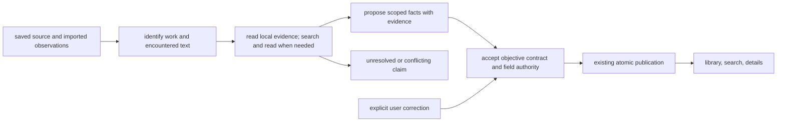

# media metadata: works, editions, and evidence

historical research only. the approved [lean hard-cutover spec](original-publication-dates-hard-cutover.md) supersedes its proposals. persistent field evidence, a metadata editor, and a semantic benchmarking project were explicitly rejected; they are not deferred requirements.

**the primary date should locate the work in intellectual history.** for a penguin copy of heart of darkness, show **1899**, with serialization identified in details. retain **1902** as first book publication and the particular penguin edition's date separately. the joseph conrad society documents the serial appearance in february–april 1899 and the later collection publication. the actual penguin edition has not been supplied or inspected, so its date remains unspecified here. [[1]](https://www.josephconradsociety.org/student-resources/)

this preference is a legitimate product definition. a personal reading library answers when a work entered public life; a retail catalog often answers when a particular edition became available. both questions deserve correct answers. the defect is allowing a single field to answer either question without saying which.

“overfitting” is not established by the available evidence. the inspected code instead supplies edition-oriented hints, omits an explicit original-publication rule, limits source context, and prohibits research. that is a sufficient architectural explanation for the reported symptom, although the exact failed import and its generation receipt have not been examined.

this is a proposed design, not an implemented contract. repository evidence was inspected at `7fa89b88c8342bca9edfb46a6d20053c49555fb2` with pre-existing working-tree changes. no production records, live application behavior, or provider benchmark results establish accuracy here.

**the concepts have to precede the prompt.** three propositions are independent: this saved source contains this work; this evidence supports this event and date; this product chooses that event for its primary chronology. collapsing them invites a plausible date for the wrong object. a model can reason about all three, but the product must give them stable meanings.

bibliographic standards offer useful distinctions without dictating the whole implementation. ifla's work, expression, manifestation, and item distinguish intellectual creation, realization, embodiment, and individual copy. its representative-expression discussion accommodates facts users regard as characteristic of a work. bibframe uses work, instance, and item; wikidata's books practice centers work and edition. their differences are a reason to borrow concepts deliberately. none requires nexus to recreate a national library catalog. [[2]](https://www.ifla.org/files/assets/cataloguing/frbr-lrm/ifla-lrm-august-2017.pdf) [[3]](https://www.loc.gov/bibframe/docs/bibframe2-model.html) [[4]](https://www.wikidata.org/wiki/Wikidata:WikiProject_Books)

the organizing philosophy is an accountable research librarian. observations retain where they came from. accepted claims say what they concern. the interface selects the facts useful to reading. explicit corrections remain the owner's decisions. stronger intelligence should improve identification and evidence assessment while those contracts remain intelligible.

this fits nexus's existing division of responsibility: the domain owns meaning and publication; the shared runtime owns execution. machine judgment belongs where semantic interpretation is necessary. calendar validity, evidence-reference membership, tool authority, and correction precedence belong in explicit contracts. a schema can prove that a source reference exists; it cannot prove that the source tells the truth.

**the current path explains both the symptom and the repair boundary.**

| boundary | inspected behavior | implication |
| --- | --- | --- |
| source ingestion | [epub extraction](../../python/nexus/services/epub_ingest.py) at 1526–1529 reads package `dc:date`; [epub publication](../../python/nexus/services/epub_metadata.py) at 35–36 writes it into `media.published_date` | the epub source can be correct while the product date is wrong: the standard defines this as the epub publication's date. [[5]](https://www.w3.org/TR/epub-33/#sec-opf-dcdate) |
| pdf ingestion | [pdf metadata](../../python/nexus/services/pdf_metadata.py) at 29–30 promotes `pdf_creation_date` to publication | exporting or scanning a file can manufacture apparent historical recency |
| identifiers | [epub extraction](../../python/nexus/services/epub_ingest.py) at 126–137 and 1499–1531 does not retain package identifiers in its metadata result | useful isbn and other edition hints are lost; a package uuid must still not be mistaken for an isbn |
| source sample | [metadata enrichment](../../python/nexus/services/metadata_enrichment.py) at 258–336 takes leading text; [configuration](../../python/nexus/config.py) at 573–575 defaults to 2,000 characters | title pages, copyright history, and discriminating contents can fall outside the sample; the 32 kib prompt ceiling does not mean the model sees 32 kib of evidence |
| instructions and policy | [prompt](../../python/nexus/services/metadata_enrichment.py) at 49–64 forbids tools and specifies only date syntax; [policy](../../python/nexus/services/generation_policy.py) at 288–296 selects a low-reasoning background generation without research tools | neither a defined original-publication target nor external verification currently exists |
| accepted output | [output and merge](../../python/nexus/services/metadata_enrichment.py) at 173–245 and 730–744 contain flat values and assign non-null results | no field evidence or work/edition scope; null means leave the current value, so rerunning alone cannot reliably remove a known wrong date |
| date validation | [schema](../../python/nexus/services/metadata_enrichment.py) at 222–233 checks a digit pattern | impossible dates such as `2023-99-99` satisfy the pattern; calendar validation is a separate defect |
| web capabilities | [tool profiles](../../python/nexus/services/tool_runtime/profiles.py) at 38–68 and [composition](../../python/nexus/services/tool_runtime/composition.py) at 130 expose search without a model-callable reader | metadata research requires a reviewed capability extension |
| available dependency | [exact tools pin](../../python/pyproject.toml) at 64 already includes a non-ingesting `web.read` implementation | basic web reading needs nexus integration, not a new scraping subsystem |
| publication | [metadata task](../../python/nexus/tasks/enrich_metadata.py) at 781–925 locks, rechecks admitted input, commits accepted fields and its publication receipt, and advances collections | preserve these existing guarantees; a new agent loop must not bypass them |
| downstream meaning | [library ordering](../../python/nexus/services/library_entries.py) at 2502–2512, [author chronology](../../python/nexus/services/contributor_credits.py) at 105–109, and [recency](../../python/nexus/services/resonance/_evidence.py) at 486–488 consume the date | the change affects ordering, discovery, and recency, not merely a label |
| repair interface | [resource actions](../../apps/web/src/lib/actions/resourceActions.ts) at 486–503 provide re-enrichment and author editing; [inspector surfaces](../../apps/web/src/components/resource-inspector/inspectorSurfaces.ts) at 22–30 lack factual metadata details | the owner cannot directly inspect or repair the date |

the metadata task already checks whether its admitted input changed before publication. author observations also respect manual author management in [contributors](../../python/nexus/services/contributors.py) at 792–809. these are useful existing mechanisms. extending evidence and field authority does not justify replacing the durable workflow or inventing a second general override framework.

**the expert perspectives converge on precise semantics and disagree about how much machinery to expose.** these are disciplinary positions developed through parallel agent reviews, not interviews with human experts.

| perspective | question it asks | choice it would reject | resolution |
| --- | --- | --- | --- |
| bibliographer | which entity and publication event does this date describe? | a bare “original” field with edition identifiers treated as work identifiers | distinguish work identity, encountered edition, and event |
| historian | first installment, completed serial, first volume, composition, or public circulation? | assuming every earlier number answers the same historical question | adopt an explicit first-public-appearance rule for published works; keep other events distinct |
| textual scholar and translator | which text was actually read? | losing revision, translation, abridgment, or contributor identity when normalizing the work | preserve encountered text facts and source anchors |
| retrieval specialist | what evidence establishes the match and supports first publication? | trusting a search snippet, isbn hit, or model recollection as sufficient for every case | identify candidates, inspect decisive sources, and abstain when unsupported |
| product designer | what must be visible to understand or repair the record? | four catalog screens or a review queue for every import | one compact date and one details surface |
| systems engineer | who can change a selected value, and what survives replay? | generated output overwriting a user correction or creating a parallel job system | reuse publication ownership; make field authority explicit |
| minimalist architect | does a new abstraction absorb present complexity? | a universal knowledge graph erected merely to repair publication dates | a narrow metadata record attached to existing media |
| agent advocate | where can model judgment replace brittle rules? | catalog-specific heuristics for every author, language, and historical exception | let the model research and interpret; keep meanings, boundaries, and acceptance explicit |

agreement should come from concrete examples and falsifiable contracts. 1899 serialization and 1902 book publication are compatible facts. they are not competing votes about one event. a three-agent majority that confuses them has added expense without adding understanding.

**the proposed semantic contract has two scopes and explicit date events.** keep saved media identity attached to its source, reading progress, highlights, and locators. attach a resolved work description, including an external work identifier when supported. retain edition identifiers and encountered-text facts separately. do not merge files, transfer annotations, or infer identity from title equality.

a deduplicated work table is not necessary for this change's correctness. the immediate consumer needs an evidenced work relationship, scoped facts, and a chosen date. a typed metadata record associated with media can provide those. the explicit cost is duplicate research and possible disagreement between two saved copies. a shared work entity earns its place when cross-copy consistency, shared corrections, or edition navigation becomes actual product behavior.

the selected publication claim should identify its subject, event, date, evidence, and resolution. those fields have current owners: identity disambiguation, date selection, display/sorting, inspection, and unresolved/conflict behavior. source facts should retain their source identity and relevant origin; raw imported values must not re-enter future prompts disguised as verified work facts.

| content situation | primary chronology rule | facts retained separately |
| --- | --- | --- |
| single published literary work | first publication established by matching publication-history evidence, counting the beginning of serialization | first book appearance, this edition, translator, revision |
| anthology or collected volume | first publication of the identified aggregate | dates of constituent works, if separately established |
| translation | original work's publication for work chronology | translation date, translator, language of the actual text |
| material revision | original work chronology, with explicit revision identity | revision date and encountered edition; unresolved identity stays unresolved |
| research article or preprint | first public release established for the identified work; an earlier preprint becomes primary only when same-work identity and its place in the publication history are supported | preprint posting, online publication, print publication, version of record |
| ordinary web article, episode, or video | first release of that identified article, episode, or video | later update, repost, upload, recording/performance date |
| digitized historical work | the work's evidenced publication | scan, export, digital edition, and upload dates |
| ancient, oral, or unpublished work | publication remains unknown where the concept is unsupported | visibly labeled composition/origin information when supported |

format is not content identity. `pdf` can contain a novel, a paper, or a private draft; `epub` can contain an anthology. classify the item from its evidence instead of turning file extensions into bibliographic law. for scholarly material, an earlier related document is not automatically the same work. crossref's separate online, print, and posted-content conventions provide a useful precedent. [[6]](https://www.crossref.org/documentation/principles-practices/best-practices/bibliographic/) [[7]](https://www.crossref.org/documentation/schema-library/markup-guide-record-types/posted-content-includes-preprints/)

for papers, this deliberately chooses work chronology over encountered-version chronology. an established earlier preprint therefore changes primary sorting; journal publication remains a separate version fact used for version-specific citation. where work origin cannot be established, the primary claim stays unresolved and the known version date remains labeled in details. the product review preferred encountered-version chronology for scientific clarity; the bibliographic review preferred consistent work chronology. the latter better fits this library's stated purpose, at the cost of making the preprint/journal distinction conspicuous.

date precision is knowledge. retain year, month, and day precision without fabricated january 1 values. where actual material requires circa, intervals, or bce, use a documented small bibliographic-date subset with explicit era conversion and display. edtf supplies vocabulary for this, without requiring the entire standard. unsupported historical values stay unresolved instead of being coerced into four digits. [[8]](https://www.loc.gov/standards/datetime/edtf.html)

this recommendation does not silently fall back from “first published” to composition or edition year. richer historical chronology can later offer an explicitly named “work origin” lens. that trades immediate coverage of ancient works for a stable meaning of publication. interval ordering, when supported, must disclose its convention: ordering by the earliest supported bound is a browsing arrangement, not proof that overlapping periods have a known sequence. recency must never turn approximate or partial dates into exact release instants.

**give the metadata resolver search and read, within the existing generation workflow.** search locates candidate records and passages. reading establishes what those sources actually claim. use identifiers to help connect the saved edition to a work, then inspect publication-history evidence about that work. a catalog's earliest known edition does not establish that no earlier publication existed; wikidata practitioners have explicitly encountered that distinction. [[9]](https://www.wikidata.org/wiki/Wikidata_talk:WikiProject_Books/2016)

the intended flow is:

one metadata-owned resolver should be able to do the following in a bounded run:

1. inspect existing source observations and a useful initial sample. retrieve additional local title, copyright, contents, or bibliographic passages when those would distinguish candidates.
2. establish semantic content identity and the encountered version. preserve identifiers with their scheme; an isbn locates an edition, while a package uuid merely identifies a package.
3. search for a missing or suspect fact using title, creator, and discriminating context. for firstness, request publication-history evidence rather than just a bare date.
4. read the relevant candidate source. a source's own update timestamp and a search engine's date label cannot support the work's publication date.
5. return only supported scoped facts, with retained evidence references. unresolved facts remain explicit. obtain another source when there is actual identity or event ambiguity, material contradiction, or only indirect evidence.
6. let the metadata owner apply the accepted result, respecting user authority and the existing admitted-input check. keep reading available while metadata research runs.

one direct, well-matched, authoritative account can suffice. two retailers copying one feed are not independent corroboration. conversely, an authoritative institution's page about the wrong edition still cannot establish the original work date. source quality is conditional on the claim, not a permanent domain ranking.

the inspected `llm-tools` commit `9e6d155f3b64f03495911435b7cae8b8d131f9a2` already exports `WEB_READ_SPEC`, `bind_web_read`, and `SafeWebReader`. its reader returns inert content and evidence receipts without creating a library item. nexus's existing [dossier page reader](../../python/nexus/services/agent_tools/web_page_read.py) instead ingests a build-owned research result. that side effect makes it the wrong metadata reading boundary.

integration must cover the reviewed tool declaration/profile, binding, immutable authority snapshot, budgets, evidence receipt handling, and metadata output/publication contract. merely deleting “never use tools” from the prompt does none of that. keep local reads scoped to the saved resource. external queries should use necessary identifying facts; sending arbitrary private document text is not needed for ordinary bibliographic matching.

the portable reader currently supports html/xhtml, plain text, and json. it does not provide authenticated browsing, javascript execution, scanned-page vision, or pdf reading. this limits attainable coverage. public catalog and bibliographic html will often suffice; a source available only in another format must remain unavailable until an explicit bounded reading capability supports it. do not claim a searched pdf was inspected.

budgets need joint qualification. the existing reader can emit up to 64 kib of utf-8 text per call and reserves 512 kib of serialized output; several reads can exhaust the generation's context even if the call count looks small. a starting experiment could permit three searches, four web reads, and two targeted local reads, with a shared token/byte budget and wall-clock deadline. these counts are experimental knobs, not validated best practice. choose final bounds from accuracy, unresolved rate, latency, and actual context use.

the default runtime should use one capable resolver. a permanent council on every import adds correlated judgments and failure states. an optional second review is worth evaluating for stubborn conflicts if it seeks discriminating evidence. it should not merely vote on the first model's answer. anthropic's workflow guidance and self-rag motivate adaptive retrieval and evaluation, but neither establishes a bibliographic accuracy rate or an optimal number of agents for nexus. [[10]](https://www.anthropic.com/engineering/building-effective-agents) [[11]](https://arxiv.org/abs/2310.11511)

**evidence must make correction possible, not decorate an answer.** retain a source reference, the relevant passage or structured datum, enough surrounding identity context, and the retrieval or local-source revision identity. bind generated references to evidence actually available in the run. keep short factual rationale where it explains event selection, such as serial versus volume publication. no chain-of-thought transcript is required.

use categorical outcomes with concrete meanings: supported, unresolved, and conflicting. user-selected authority is a separate axis. a manually entered date may be selected without being externally verified. “your correction” states why it wins; it does not claim historical proof. a deliberate blank is also a correction, and re-enrichment must not fill it until the owner returns that field to automatic management.

this is a small domain record and a correction command, not a universal assertion database. reuse generation and source receipts where suitable; retain the decisive evidence needed by the product when execution records have a different lifetime. full mirrored websites, every discarded search result, and a generic provenance graph are unnecessary for the proposed interface.

the alce research separates answer correctness from citation quality. borrow that distinction: a functioning link is not evidence that a claim is supported. do not transfer old benchmark percentages to current models or this task. [[12]](https://aclanthology.org/2023.emnlp-main.398/)

**steal the mature product patterns and leave their mismatched defaults behind.**

| precedent | observed feature or report | what nexus should take | limitation or rejected part |
| --- | --- | --- | --- |
| musicbrainz picard | distinct specific-release and original-release tags, with an official reissue example | separate facts plus a selected primary date | its demonstrated fallback to edition date would silently change the meaning of nexus's first-publication field. [[13]](https://picard-docs.musicbrainz.org/en/v2.13/extending/scripts.html) |
| plex | manual edits automatically lock fields against metadata refresh; separate fix-match workflow | durable user authority and identity repair distinct from field editing | a correct-looking manually edited year cannot cure a wrong work match. [[14]](https://support.plex.tv/articles/201272763-edit-details/) [[15]](https://support.plex.tv/articles/201018497-fix-match-match/) |
| calibre | direct editing, candidate metadata retrieval, isbn preferred when supplied | identifier-assisted matching and straightforward repair | isbn-first lookup naturally gravitates toward an edition. [[16]](https://manual.calibre-ebook.com/metadata.html) |
| open library | work-level first-publication search fields; work/edition page redesign informed by user research | use work records as candidates and present work plus copy context together | a catalog field is evidence rather than an oracle; the 2020 usability research was exploratory. [[17]](https://openlibrary.org/dev/docs/api/search) [[18]](https://blog.openlibrary.org/2020/07/08/re-thinking-open-librarys-book-pages/) |
| storygraph | a user saw missing publication information despite a visible edition date; the founder distinguished the missing original year | label which date sorting uses and explain unknown originals | the report demonstrates one failure pattern, not its prevalence. [[19]](https://roadmap.thestorygraph.com/requests-ideas/posts/-missing-pub-info-date-but-date-listed-in-edition-s-stats-) |
| zotero | documents distinct original-publication variables | preserve original and encountered publication facts | nexus's primary date should not be buried in miscellaneous citation metadata. [[20]](https://www.zotero.org/support/kb/item_types_and_fields) |
| readwise reader | metadata editing in the information sidebar, including pdf workflows | place factual repair next to inspection | ai extraction alone does not determine the intended publication event. [[21]](https://docs.readwise.io/reader/docs/faqs/pdfs) |

calibre users independently describe reprint or gutenberg ebook dates contaminating historical catalogs. another report describes bulk metadata scrambling previously acceptable matches. these are useful qualitative failure cases, not population measurements or evidence about nexus's current runtime. [[22]](https://www.reddit.com/r/Calibre/comments/1fk6qmf/automated_way_to_get_the_original_publication/) [[23]](https://www.reddit.com/r/Calibre/comments/1d3njox/metadata_download_scrambling_the_information/)

**the interface should reveal the distinction exactly where it matters.** retain the compact date in library and search rows. derive the accessible label from the selected event—such as “first published” or “first shared as a preprint”—and provide one factual details surface through the existing resource actions and inspector. current reader headers principally show authors; there is no need to add permanent bibliography chrome to the reading surface.

for the example, the intended details are:

| field | value |
| --- | --- |
| work | heart of darkness |
| creator | joseph conrad |
| first published | 1899 — serialized |
| publication history | serial appearance february–april 1899; first book appearance 1902 |
| this edition | penguin; date and edition details only when identified |
| evidence | directly inspectable source for the selected claim |
| correction | edit the date or identity; return explicitly to automatic metadata |

avoid presenting “penguin · 1899” as though it were a single coherent publication citation. a reader-facing work title and date can coexist with edition-level publisher, translator, and language, provided their scopes are clear. do not change the text's language to the original language merely because the work date was normalized.

details should be available without generating a dossier. show relevant populated facts during inspection and supported fields during editing. put evidence disclosure beside the fact. inspecting evidence should not advance reading progress or replace the source being read.

routine supported corrections can publish automatically. failures or ambiguity stay local to metadata; the reader remains usable. “research again” should say what happened: confirmed, changed, unresolved, or conflicting. a generic enrichment-success timestamp cannot stand in for that distinction.

manual edits should win until explicitly reset. nexus already has this idea for author credits, and plex offers a strong public precedent. a wrong user correction can therefore persist; this is the accepted cost of user ownership. visible evidence and explicit reset are the repair mechanism.

**several ambitious ideas are worthwhile, but they have different prerequisites.**

| idea | judgment | reason and trade-off |
| --- | --- | --- |
| a miniature publication history beside the selected date | include when the evidence already distinguishes events | turns an opaque correction into understandable history; adds a small amount of detail |
| ask what would disprove the work match before researching dates | evaluate now | author, contents, translation, and aggregate checks may prevent confident wrong matches; spends retrieval on identity before completion |
| inspect a copyright-page image when extracted text is inadequate | selective extension | valuable for edition identity; requires a qualified multimodal reading path and additional latency |
| natural-language repair, such as specifying an earlier textual revision | later, through the same correction command | expressive and personal; a preview is needed when identity changes dependent facts |
| a curator that researches unresolved items currently being read | later, through existing jobs | directs effort toward current value; less relevant items may remain incomplete longer |
| reuse accepted work facts across verified copies | later, when shared work behavior is introduced | reduces duplicate research and inconsistent dates; requires explicit identity and correction scope |
| a chronological atlas with uncertainty intervals | later, after date semantics and evaluation | supports intellectual history; a polished timeline otherwise makes unsupported dates more persuasive |
| force the resolver to compare its chosen event with the strongest alternative | targeted experiment | distinguishes 1899 serial from 1902 book; unnecessary overhead for unambiguous cases |
| permanent multi-agent voting on every field | reject | agreement over shared priors is weak evidence; multiplies cost and failure states |
| choose the oldest date found | reject | selects author biographies, component works, catalog errors, and different editions indiscriminately |
| add a global preference for every publication-event type | reject for this product | exports unresolved semantics into settings; a fixed personal default and inspectable facts are clearer |

the distant ambition is a library that knows why it locates a work in history. the immediate high-quality foundation is already modest: correct identity, scoped dates, retained evidence, and durable correction. a larger architecture earns its cost through those behaviors.

**the implementation sequence should expose decisions before encoding them.**

1. specify the event rules, field scopes, correction authority, and acceptance examples. define the date projection consumed by library, search, contributors, and recency. distinguish publication chronology from arrival in nexus.
2. separate imported observations from resolved work facts. retain useful source identifiers. stop promoting pdf creation into publication. define explicit replacement and clearing so legacy wrong dates can actually be removed.
3. integrate the existing reader and a metadata read profile into the canonical tool runtime. add targeted source access, joint budgets, and evidence-linked output. preserve durable admission, uncertain-dispatch handling, replay, and atomic publication.
4. add the single metadata details/correction surface, reusing author-management precedent and canonical resource actions. make identity repair and date repair distinguishable.
5. compare resolver candidates against an independently reviewed corpus. include the current prompt-only approach, an explicitly work-oriented prompt, local evidence plus identifiers, and the bounded search/read resolver. use a stronger qualified model as a quality reference; choose the deployed model from results rather than its branding or price.
6. backfill existing items deliberately. do not rename old `published_date` values into verified originals. preserve legacy observations as unclassified where their origin is unknown, research the work, publish supported replacements, and retain unresolved results honestly.

backfill should use normal job and publication owners with bounded admission. do not re-ingest files, alter reader identities, or erase source facts. changing publication semantics requires coordinated consumers and tests, even for one user. a metadata-only migration that leaves search or recency using the old meaning is incomplete.

**the acceptance corpus must test the question, not just json shape.** include the actual failed penguin item when available, plus independently sourced cases covering serialization, translations, aggregates, revisions, same-title collisions, missing identifiers, ancient dates, and scholarly version relationships. reserve cases not used to tune the prompt.

| case | required result |
| --- | --- |
| penguin heart of darkness | original work date 1899, serial role, first book 1902, edition separate |
| publication history lies beyond the initial 2,000 characters | resolver reads relevant source context or a supporting external source |
| nineteenth-century content exported to pdf today | export timestamp never becomes original publication |
| anthology containing an older novella | date follows the aggregate identity, not its oldest constituent |
| modern translation | work chronology preserved alongside translator, translation, and actual language |
| same title, different creator | no confident first-hit match |
| preprint and later journal version | a supported same-work publication history selects earlier public posting; journal release and encountered version remain separate; unresolved work origin never silently inherits the version date |
| year-only evidence | no fabricated month, day, or instant |
| contradictory sources about different events | distinguish the events before declaring factual conflict |
| source unavailable or contradictory about the same event | explicit unresolved or conflicting result |
| valid source link with irrelevant passage | unsupported date is rejected by the evidence-quality evaluation |
| impossible calendar date | rejected at ingress |
| manual date or deliberate blank followed by refresh | user selection survives until explicit reset |
| source changes during research; worker resumes after completion | existing stale-input and replay guarantees hold |
| malicious source instructions | source text cannot change the publication policy, widen resource access, grant writes, or disclose private passages through tool calls |
| corrected date | details, search, library order, and affected chronology use the same selected fact |

add metamorphic cases: changing only a reprint's year must not change its work date; changing the author of an identically titled work must trigger identity reassessment; removing the sole supporting passage must remove its supported status. use corrections as reviewed future evaluation examples, not automatically generalized rules.

measure accepted-claim accuracy, identity accuracy, event accuracy, evidence support, appropriate abstention, unresolved coverage, manual override preservation, and user correction burden. measure latency and cost alongside quality. a model that achieves high accuracy by leaving everything unknown has not solved the product task.

deterministic proofs should check calendar semantics, source-reference binding, selection policy, clearing, override behavior, publication atomicity, and replay with controlled sources. hosted semantic evaluations must exercise the real model and retrieval boundary on reviewed questions. the repository's required command owner remains `./scripts/test`; no tests were run for this research-only change. existing prompt framing and schema tests cannot establish historical correctness.

the literature reinforces the event problem beyond books. haustein, bowman, and costas compare several publication and indexation dates for scholarly papers; different event definitions affect downstream interpretation. that is evidence for explicit dates, not justification for importing a universal “earliest timestamp” rule. [[24]](https://arxiv.org/abs/1505.00796)

**the remaining product questions have proposed answers.** count the start of serialization: yes. preserve translation and revision identity: yes. treat a genuine collection as its own work: yes. retain known edition dates when original publication is unknown: yes, clearly labeled and outside original-publication sorting. leave unsupported ancient publication unknown: yes; a composition chronology deserves its own named policy. propagate corrections across copies: only after evidenced shared identity and an explicit shared-scope operation.

these questions need to be asked when they change the actual record's interpretation. none requires interrupting every import. the main unresolved empirical questions are which resolver/model combination meets the quality target, how much source access it needs, and which historical edge cases occur in the real library.

**the trade-offs are explicit.** work chronology replaces edition chronology in the primary view; details preserve edition facts. clear unknowns reduce apparent completeness. search/read increases runtime, dependency exposure, and some external query disclosure. evidence retention adds small durable records. direct human authority can preserve a mistaken correction. one resolver for normal cases accepts imperfect semantic judgment instead of a costly permanent council. local work records postpone global consistency. a small historical-date subset limits coverage until more date forms are deliberately supported. one details surface adds interface weight, so it should absorb both inspection and repair.

those costs buy a system whose behavior is explainable. the objective is that a changed date means a better-supported answer to the same question.

**implementation scope** is narrowed to work/edition separation, removal of pdf creation dates, epub isbn hints, scoped research, read-only media info, and calendar validation. see the [module guide](../modules/media-metadata.md). the user rejected persistent field evidence, editing/pinning, and a benchmarking project. the [approved spec](original-publication-dates-hard-cutover.md) owns implementation scope; the preceding broader research is historical rationale.

**sources.** official specifications and product documentation establish their own semantics and features; user reports supply examples rather than prevalence estimates. paper claims are bounded to their studied tasks. pages were consulted on 2026-09-14; no date is invented where a source lacks one.

1. joseph conrad society. [student resources](https://www.josephconradsociety.org/student-resources/), undated. publication history inspected; access was intermittently unavailable.
2. ifla. [library reference model](https://www.ifla.org/files/assets/cataloguing/frbr-lrm/ifla-lrm-august-2017.pdf), august 2017, especially §5.6. relevant text checked through indexed extracts; [2024-07 revision](https://repository.ifla.org/bitstreams/7d23aa55-1f85-490f-b500-6170285585a6/download) likewise checked through indexed extracts; direct access restricted.
3. library of congress. [overview of the bibframe 2.0 model](https://www.loc.gov/bibframe/docs/bibframe2-model.html), 2016.
4. wikidata. [wikiproject books](https://www.wikidata.org/wiki/Wikidata:WikiProject_Books), living community documentation.
5. w3c. [epub 3.3, the dc:date element](https://www.w3.org/TR/epub-33/#sec-opf-dcdate), recommendation dated 2026-01-13.
6. crossref. [bibliographic metadata best practices](https://www.crossref.org/documentation/principles-practices/best-practices/bibliographic/), living documentation.
7. crossref. [posted content, including preprints](https://www.crossref.org/documentation/schema-library/markup-guide-record-types/posted-content-includes-preprints/), living documentation.
8. library of congress. [extended date/time format specification](https://www.loc.gov/standards/datetime/edtf.html), 2019 specification.
9. wikidata contributors. [wikiproject books discussion archive](https://www.wikidata.org/wiki/Wikidata_talk:WikiProject_Books/2016), 2016; practitioner discussion.
10. erik schluntz and barry zhang, anthropic. [building effective agents](https://www.anthropic.com/engineering/building-effective-agents), 2024-12-19; engineering guidance.
11. akari asai and coauthors. [self-rag: learning to retrieve, generate, and critique through self-reflection](https://arxiv.org/abs/2310.11511), 2023 preprint / iclr 2024.
12. tianyu gao, howard yen, jiatong yu, and danqi chen. [enabling large language models to generate text with citations](https://aclanthology.org/2023.emnlp-main.398/), emnlp 2023.
13. musicbrainz picard. [scripts: use original release date](https://picard-docs.musicbrainz.org/en/v2.13/extending/scripts.html), version 2.13.3 documentation; intentionally cited as an established feature example.
14. plex. [edit details](https://support.plex.tv/articles/201272763-edit-details/), product documentation.
15. plex. [fix match / match](https://support.plex.tv/articles/201018497-fix-match-match/), product documentation.
16. calibre. [editing ebook metadata](https://manual.calibre-ebook.com/metadata.html), living manual.
17. open library. [search api](https://openlibrary.org/dev/docs/api/search), living api documentation.
18. open library. [re-thinking open library's book pages](https://blog.openlibrary.org/2020/07/08/re-thinking-open-librarys-book-pages/), 2020-07-08; first-party design research.
19. the storygraph. [missing publication information despite an edition date](https://roadmap.thestorygraph.com/requests-ideas/posts/-missing-pub-info-date-but-date-listed-in-edition-s-stats-), january 2025 report and founder response.
20. zotero. [item types and fields](https://www.zotero.org/support/kb/item_types_and_fields), living documentation.
21. readwise. [reader pdf frequently asked questions](https://docs.readwise.io/reader/docs/faqs/pdfs), living documentation.
22. r/calibre contributor. [automated original-publication lookup](https://www.reddit.com/r/Calibre/comments/1fk6qmf/automated_way_to_get_the_original_publication/), 2024; anecdotal report.
23. r/calibre contributor. [metadata download scrambling information](https://www.reddit.com/r/Calibre/comments/1d3njox/metadata_download_scrambling_the_information/), 2024; anecdotal report.
24. stefanie haustein, timothy d. bowman, and rodrigo costas. [when is an article actually published?](https://arxiv.org/abs/1505.00796), 2015.
