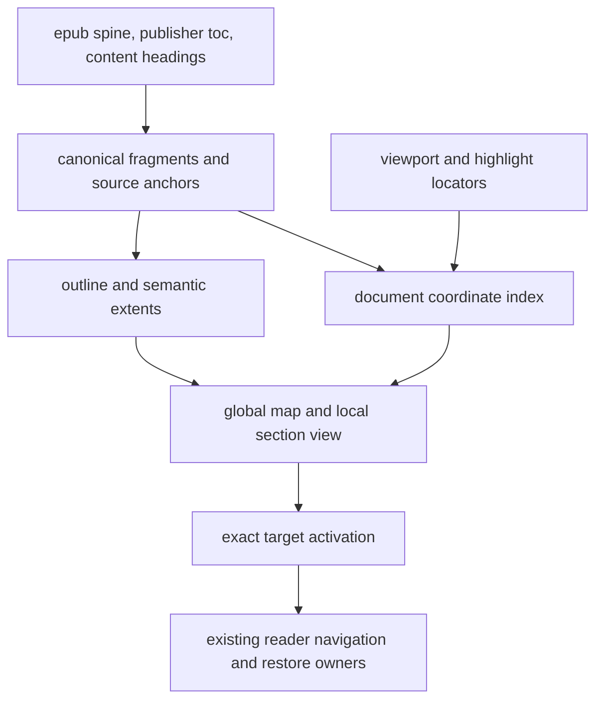

# reader document map: structure, measure, and navigation

the reader needs a complete outline over a stable document coordinate system,
with separate global and section views. two independent mechanisms explain
chapters collapsing into one node: epub ingestion omits content headings that
are absent from the publisher's contents, and the rail chains nearby markers
into arbitrarily large median-position clusters. changing length arithmetic
alone would leave both failures intact.

the implementation contract is now the [structure hard-cutover spec](reader-document-map-structure-hard-cutover.md).
this review retains the research and rationale from the documentation-only audit.
implementation and final evidence live in the [verification log](reader-document-map-verification.md).
the audit baseline is
`7fa89b88c8342bca9edfb46a6d20053c49555fb2`; external sources were checked on
2026-09-11. the reported affected book is *shadow & claw* by gene wolfe.
the findings below are static code findings unless explicitly identified as
product documentation, user reports, or design judgments. no runtime proof of
that particular imported edition is claimed. the bounded read-only lookup
could not connect to the existing dev database at `localhost:54320`; both
ipv4 and ipv6 connections were refused before any query ran. the exact-book
acceptance work is recorded in the [verification log](reader-document-map-verification.md#exact-edition-witnesses).

## demonstrated problems and existing strengths

| finding | evidence and consequence | disposition |
| --- | --- | --- |
| missing epub headings | `epub_ingest.py:2536-2585` uses publisher toc entries, otherwise one fallback per xhtml fragment. a file containing many chapters can yield one navigation node. | [resolved](reader-document-map-verification.md#final-focused-acceptance) |
| transitive visual collapse | `ReaderDocumentMapOverviewRail.tsx:590-607` joins each marker to its predecessor when their separation is below 24px, then displays the group at its median. highlights can bridge chapters. | [resolved](reader-document-map-verification.md#final-focused-acceptance) |
| section extents lack semantic meaning | `epub_ingest.py:2599-2610` ends a section at the next target in the same fragment. a parent ends at its first child; a chapter cannot span files. this is a representation gap against the requested behavior. | [resolved](reader-document-map-verification.md#final-focused-acceptance) |
| current section follows navigation state | `MediaPaneBody.tsx:5692,5701` uses the loaded epub target or last selected web section. scrolling through headings in one resource does not update that identity. no section-local projection exists. | [resolved](reader-document-map-verification.md#final-focused-acceptance) |
| sequential navigation can reverse direction | ingest retains toc order within a fragment; previous/next uses adjacent navigation rows. the accepted structural-anchor fixture explicitly has targets out of source order. | [resolved](reader-document-map-verification.md#final-focused-acceptance) |
| themed decoration owns another progress history | the rail records viewport reach and dwell in local storage without reading intent, publication revision, or reset semantics. its displayed historical snapshot also stays stale during a session. | [resolved](reader-document-map-verification.md#final-focused-acceptance) |
| offline web offsets mix coordinate spaces | `DocumentReaderSession.ts:204-220` puts document prefix sums into fields whose shared contract is fragment-relative. lengths 100 and 20 produce second-fragment bounds `[100,120]`, instead of `[0,20]`. | [resolved](reader-document-map-verification.md#final-focused-acceptance) |
| long colliding navigation ids can hang ingestion | `epub_ingest.py:2624-2647` appends a uniqueness suffix and then truncates it away. two targets sharing the first 255 characters can loop indefinitely. | [resolved](reader-document-map-verification.md#final-focused-acceptance) |

the core position investment is sound. the document-map service sums unique
canonical fragments once, and source locators project through fragment prefix
lengths. the browser also has a pure document-position projection and an
intent-bearing semantic viewport. these should remain the foundation, not be
replaced with scroll-height percentages.

individual desktop chapter and evidence markers already dispatch to owned
source targets: `MediaPaneBody.tsx:6835-6891`. evidence activation resolves the
passage, loads its fragment if necessary, and positions the reader. the audit
does not establish that every marker click is broken. cluster buttons
deliberately open a member list; the current-position band and themed bud are
inert; mobile deliberately uses a passive ribbon. those last behaviors are
product-contract changes under the new request. implementation is complete;
the [interaction ticket](../tickets/reader-map-inert-position-and-mobile-controls.md)
retains the remaining operator accessibility review.

the existing [canonical-position cutover](reader-document-map-canonical-position-hard-cutover.md)
already says position is source truth and progress is a projection. its
implementation solved duplicate fragment weighting, but its median-cluster
presentation still destroys visible geography. its scope also explicitly
excluded local chapter progress. the new work should extend that model and
replace the conflicting presentation contract, rather than claim no useful
architecture exists.

## the model the council would demand

the first question is what each noun denotes. an epub resource, a publisher's
toc entry, a heading, a semantic chapter, a rendered page, and a navigation
target are different things. calling them all “sections” conceals the problem.
the epub standard separates spine order from navigation hierarchy; it does
not require one xhtml file per chapter. toc order is recommended to follow
source order, not guaranteed to do so. [epub 3.3](https://www.w3.org/TR/epub-33/#sec-nav-toc).[^1]

use these concepts:

| concept | contract |
| --- | --- |
| content unit | an existing canonical fragment, stored and rendered once, in document order |
| locator | a position or range bound to the relevant source revision, using fragment identity and canonical codepoint offsets |
| outline node | a named structural entity with hierarchy and an exact target when one exists; a parent label need not itself have a source link |
| semantic extent | the content belonging to a node, including descendants, with start and end locators that may lie in different fragments |
| display interval | a nonoverlapping span between adjacent boundary coordinates at the displayed level |
| projection | a mapping from source positions into global or local display coordinates |
| reading state | existing resume, engagement, and completion facts; not inferred afresh by the rail |

the distinction between semantic extents and display intervals is essential.
a chapter includes its subsections, so parent and child extents overlap. a
single linear rail cannot give every nested node an outgoing edge equal to its
entire inclusive extent without double-counting. at full detail, an edge means
content until the next boundary. at chapter level, chapter spans remain distinct
from uncovered introductory, interstitial, or trailing spans. for example,
a chapter ending at 100 followed by the next chapter starting at 200 leaves
100 units of interstitial content; the edge between chapter starts is not the
first chapter's length. interval-end ticks expose that gap without inventing
an authored chapter. the outline retains all nodes at either display level. same-position nodes
have no distance between them; a label or hit-target requirement must not
invent positive content length.

this is a conceptual decomposition, not a request for seven new services.
the existing ingestion, navigation, position, activation, and publication
owners can implement it.

### measurement and invariants

retain canonical unicode codepoints as the text rail's measure. let fragment
lengths be `l₀ … lₙ`, their prefix sums `pᵢ`, and document length `l`.
for a locator in fragment `i` at offset `o`, the document coordinate is
`x = pᵢ + o`.

| projection | definition |
| --- | --- |
| document position | `x / l` |
| position within a positive-length section `[a,b)` | `(x - a) / (b - a)` |
| section span on a global rail of height `h` | `h × (b - a) / l` |
| position in a local view covering `[u,v)` | `h × (x - u) / (v - u)` |

these are coordinate percentages, not percentages understood or even read.
readium similarly distinguishes resource progression, total progression,
locations, and textual context. its location references are useful without a
publisher-supplied navigation tree. [locators](https://readium.org/architecture/models/locators/)
and [position lists](https://readium.org/architecture/models/locators/positions/).[^2][^3]

for example, a 12,000-codepoint document with chapters of 1,000, 9,000, and
2,000 codepoints has boundaries at 0%, 8.33%, 83.33%, and 100%. on a 600px
rail, the three spans are 50px, 450px, and 100px. a highlight at coordinate
5,500 is at 45.83% of the document and 50% of the second chapter. both marks
refer to the same source address. neither is obtained by scaling an xhtml file
index or a loaded viewport's scroll remainder.

the implementation must preserve these invariants:

1. fragment lengths contribute exactly once to the declared document scope.
2. labels, typography, highlights, and rail dimensions cannot change source
   coordinates or semantic chapter extents.
3. adding a highlight cannot move, remove, or merge chapter boundaries.
4. each displayed partition covers its declared source range once. parent
   extents are not summed with descendant extents.
5. current section is derived from the current source locus. the loaded
   resource and last clicked toc entry are separate state.
6. global and local viewport bands, current-position marks, and highlight
   marks are projections of the same locators and the same measure.
7. forward sequential navigation moves forward through unique source targets;
   publisher presentation order cannot override this property.
8. activation resolves an exact locator and confirms its passage is visible.
   a percentage is not a substitute target.
9. preview, restore, return, and navigation cannot manufacture read coverage.
   existing completion and save fences remain authoritative.
10. a font or width change invalidates browser geometry, not source identity.

use half-open section intervals. at a shared boundary, select the following
section, with a deterministic deepest-node/ancestor rule. document end belongs
to the final nonempty interval for presentation. zero-length extents have no
local fraction to divide by. co-located starts do not imply zero-length extents:
a parent `[0,1000)` and child `[0,200)` have different valid local progress.
both remain navigable when they have targets. uncovered content before,
between, or after semantic sections belongs to explicit coverage spans; it must
not disappear merely because no authored heading names it.

codepoints are an explicit tradeoff. they give a stable, auditable textual
extent; they do not measure difficulty, reading time, image area, or mathematical
effort. retain the current publication scope, including retained supplementary
content, and label it document position. a future body-only scope must be
named and must change every projection consistently. pure image content has
zero textual measure; show an addressable co-located landmark, or use an
explicit page-based format model. do not silently give images invented words.
an entirely textless publication cannot display meaningful text percentages.

pdf remains page plus normalized page-space position under its existing
format contract. its percentages are not commensurable with epub codepoints.
estimated minutes and actual publisher page labels may supplement either
model but must not replace the locator or silently alter the rail metric.

### recovering structure without inventing chapters

perform structural discovery where raw source semantics and the
source-to-canonical anchor mapping coexist: ingestion/canonicalization.
extract publisher toc/ncx entries, explicit headings, and supported structural
containers there. do not rediscover the whole publication from whichever
fragment happens to be mounted in the browser.

preserve publisher labels and nesting. augment coarse navigation with missing
content headings. reconcile entries using exact source elements and mapped
anchors, not matching titles: two “introduction” headings can be different
sections, and two labels can refer to one boundary. aliases can share a
navigation target without becoming duplicate steps or duplicate content.
a parent and its first child may genuinely begin together and still be
distinct nodes.

prefer explicit container extents when the source supplies them. otherwise,
a heading's semantic end is the next peer or ancestor boundary in canonical
reading order, bounded by its containing section. headings omitted from the
publisher toc must be inserted under a source-supported parent. skipped
heading levels do not justify inventing missing chapters. publisher structures
that conflict with source order retain their authored navigation links;
only source-consistent containment becomes a semantic interval tree. report
the conflict as structural uncertainty rather than assigning a negative or
fabricated length.

the same extraction must discover stable offsets for headings without ids.
an address can be a canonical offset; adding a new html id is unnecessary
unless an existing renderer contract requires one. preserve unicode and
normalization rules across python, database, and browser. javascript dom
offsets and epub cfi offsets use utf-16 conventions that require conversion
at their adapters; they are not interchangeable with canonical codepoints.
[epub cfi 1.1](https://idpf.org/epub/linking/cfi/).[^4]

if neither navigation nor explicit headings exists, represent unsectioned
content honestly. a deterministic fallback resource entry keeps it reachable,
but does not establish that the whole file is one authored chapter. malformed
external navigation may produce an explicit incomplete-structure outcome;
an unresolved target must not acquire an approximate rail position. source
content can remain readable while structural repair is required.

semantic extents may cross fragment boundaries. adding headings must not
multiply the full-fragment rendering payload returned by `epub_read.py:401-418`.
the render unit remains the fragment; the semantic section is a range over
one or more such units.

## interaction and visual design

the strongest design is a quiet global map, an explicit local section view,
and a complete outline. this is an overview-plus-detail interface, with one
underlying coordinate system.

the global track paints every structural boundary at its true coordinate.
use tick weight or length for hierarchy. draw the current locus distinctly
from the visible viewport band. put highlights and other passage evidence in
an adjacent lane so their density cannot alter chapter geometry. render a
highlight range where scale allows, with an exact start marker at overview
scale; in the local view, clip a cross-boundary range to each intersected
section without changing the underlying annotation identity.

labels have a display budget; structure does not. suppress colliding labels
and expose them on focus or in the outline. when source targets are too close
for independent pointer activation, show a bounded group affordance with a
count and an explicit member list or local view. the group is an interaction
aid beside the exact marks, not a replacement chapter at its median.
group extent must be bounded as a whole, so a chain of nearby markers cannot
consume half a book.

a 600px track fits at most approximately 25 nonoverlapping 24px targets in one
column. a book can have 500 headings, or two headings at the same coordinate.
unlimited independent targets, exact proportions, and fixed compact size
cannot all be satisfied. the tradeoff is an extra detail interaction for dense
regions. inflating short sections or hiding headings merely conceals it.
wcag's 24px target criterion has defined exceptions, including equivalent
controls; it does not require distorting a document's coordinates.
[target-size guidance](https://www.w3.org/WAI/WCAG22/Understanding/target-size-minimum.html).[^5]

the local view magnifies an explicitly named section using the same linear
mapping. show its breadcrumb and, for example, “section 50%; chapter 63%;
document 46%” only when those are distinct useful contexts. default to the
deepest current section; expose its enclosing chapter through the breadcrumb.
keep an opened detail view stable while someone is choosing a target, instead
of changing its scope under their pointer as the viewport moves.

clicking a source-addressable chapter node jumps to its start. a targetless
outline group expands its children and is not plotted as a destination; it
must not silently acquire a first-child jump. this qualifies the every-node
interaction: every plotted node has an exact destination, while structural
group labels remain disclosures. clicking a highlight jumps to the
saved passage and reveals the range. a current-position control recentres
that exact locus; a separately named saved-reading-position control returns
to the existing resume anchor. an ambiguous group opens choices. clicking an
optional bare seek track may select a quantized source position, but that
gesture must not be described as selecting a particular semantic marker.

ordinary clicks should navigate immediately; hover or focus may preview.
provide a visible return action for excursions, retaining the original exact
locator through a sequence of inspections. reuse the reader's existing
preview/return and navigation owners; specify how deliberate jumps enter
history before adding another stack. selecting a distant location changes
where the reader is looking, not proof that intervening material was read.

navigation success means the target passage is visible, not necessarily
aligned with the viewport top: near document end, top alignment may be
impossible. use the existing semantic capture and render generation to confirm
arrival after the target resource and layout are ready. a stale target should
be reported as stale, not silently reinterpreted as a chapter percentage.

on mobile, keep the resting ribbon small, with an adequately sized named
position control opening the same outline/detail bodies in the existing
inspector sheet. the open map exposes every chapter and evidence destination.
this changes the old passive-only contract and costs one reveal interaction;
it avoids demanding precision taps on a book compressed into a few hundred
horizontal pixels. no required action may depend on hover.

native links/buttons, visible focus, logical source order, and a complete
outline should supply keyboard and assistive-technology access. use a native
range control only for a separately defined continuous seek operation; chapter
and annotation actions are discrete destinations. custom sliders need touch
assistive-technology verification. [slider pattern](https://www.w3.org/WAI/ARIA/apg/patterns/slider/).[^6]

ornament may decorate the coordinate system, but must not create data. remove
the rail's local dwell/high-water recorder. if a vine remains, its geometry
must be a pure projection of an explicitly named existing fact. use axial
distance to encode content extent; a variable-curvature decorative path's arc
length is not another progress measure. leave read-wear history out until it
has a product definition and an owner.

## precedents worth stealing

these are strong precedents for particular mechanisms, not an independently
benchmarked ranking of complete products.

| source | observed mechanism | useful borrowing and limit |
| --- | --- | --- |
| [koreader book map and page browser](https://koreader.rocks/user_guide/) | chapter hierarchy, page-scaled geography, position/history/highlight marks, adjustable detail, and thumbnail navigation; alternative headings-derived contents | the closest functional analogue: overview plus precision. its guide acknowledges adjacent-page mis-taps at dense scales. preserve source structure and provide a repair path. do not assume rendered page counts are stable text locators. |
| [kindle page flip](https://press.aboutamazon.com/uk/2016/6/amazon-announces-page-flip-a-new-way-to-hop-skim-and-jump-through-kindle-books) | exploration while retaining the reading place, with page previews | borrow reversible excursions and spatial recognition. this is a 2016 design announcement, not verification of every current device. |
| [readwise reader](https://docs.readwise.io/reader/docs/faqs) | separates current location from furthest reading progress and provides return behavior | keep orientation distinct from reading state. pace heuristics are estimates, not evidence of comprehension. |
| [microsoft annotated scrollbar](https://learn.microsoft.com/en-us/windows/apps/develop/ui/controls/annotated-scrollbar) | coordinate labels, previews, navigation, and a separate viewport indicator; colliding labels are omitted | separate source positions from labels and target presentation. the august 2026 documentation is a current platform precedent, not a reason to adopt its framework. |
| [liquidtext](https://www.liquidtext.net/liquidtextadeeperdive) and [marginnote](https://manual.marginnote.com.cn/mn4/en/mind-map-card-creating-editing-cards/) | excerpts remain connected to source passages and can be explored in other arrangements | borrow source-linked evidence and context expansion. a free-layout concept map belongs beside document geography, not in place of it. |

sources and dates are recorded below.[^7][^8][^9][^10][^11][^12]

failure reports are instructive. readwise's july 3, 2026 changelog records
epub parts failing to reveal their child chapters; it also documents repairs
to highlight destinations. these are reasons to test nesting and exact
addressing, not proof that adopting a mature library removes the problem.
[official changelog](https://docs.readwise.io/changelog).[^13]

a july 2026 koreader user described omnibus books being treated as single
chapters; an august report described chapter timing apparently covering a
whole book and said alternative contents corrected it. these are anecdotes,
without independently inspected source files. they match the failure class
well, especially for an omnibus title, but do not diagnose this copy of
*shadow & claw*. [omnibus report](https://www.reddit.com/r/koreader/comments/1uq8ysr/is_there_any_way_to_manually_set_where_each/)
and [chapter-time report](https://www.reddit.com/r/koreader/comments/1vwbiwc/koreaderzenos_time_left_in_chapter_is_incorrect/).[^14][^15]

there is no universal gold-standard length unit hiding in a library. an older
readium architecture page recommends 1,024-character positions; toolkit
history documents archive-entry-length strategies, and the architecture
discussion explicitly debates approximations. copying an arbitrary position
list would be a regression for a system that already has exact canonical
text offsets. borrow the separation between locator and progression, not an
unexamined byte-count denominator. [historical architecture](https://readium.org/technical/r2-locator-architecture/),
[toolkit history](https://github.com/readium/swift-toolkit/blob/develop/CHANGELOG.md),
and [position-list discussion](https://github.com/readium/architecture/discussions/151).[^16][^17][^18]

## council questions, disagreements, and settlements

these are analytical expert perspectives, not quotations or interviews.
agreement follows from explicit invariants and counterexamples, not a vote
between impressive job titles.

| perspective | question or objection | recommended settlement and cost |
| --- | --- | --- |
| publishing and accessibility | does the publisher toc express a deliberate hierarchy that headings alone would destroy? | preserve it, augment source-supported omissions, and distinguish aliases from hierarchy. costs reconciliation logic and some explicitly unresolved cases. |
| text systems and data modeling | what exactly is measured, and can a section cross a storage boundary? | canonical codepoints with cross-fragment extents. costs a navigation-contract change; does not estimate reading effort. |
| interaction design | how does someone select a one-paragraph section beside a 100-page chapter? | exact global marks plus local detail and a complete list. costs space or an extra activation for collisions. |
| reading research | does being at 90% imply having read 90%? | no. show current position; retain separately owned reading state. remove decorative attention inference. costs the apparent richness of a read-wear display. |
| reader/navigation engineering | does a successful click prove the exact passage loaded, including after reflow? | target-based activation and semantic arrival confirmation. reuse current machinery; costs explicit pending/arrival behavior, not another persistence system. |
| reliability and maintenance | can existing highlights, resume anchors, and offline packages survive structural repair? | preserve canonical content/fragment identity when repairing metadata; publish the changed projection through the existing generation owner. costs a controlled backfill and artifact verification. |
| standards and interoperability | should cfi become the internal address? | retain canonical offsets; add a source-tree adapter when actual interchange requires it. avoids pretending sanitized dom positions are source cfis; costs later adapter work. |
| visual design | can every nested chapter's full extent be one edge on one track? | no; show a disjoint boundary partition and hierarchical context. costs an explicit depth/scope choice. |

the deepest disagreement is between a map of text and a model of reading
effort. neither answers the other's question. this proposal chooses the former
because the requested proportional geometry and exact jumps need a stable,
shared coordinate system. estimated time can be an overlay later, with its
uncertainty visible.

the second disagreement is fidelity versus recovery. “trust the publisher”
fails when its toc names two whole books; “infer everything” fails when a
typographic heading is not a chapter. exact source-backed augmentation is the
middle with a defensible contract. unsupported inference remains a suggestion.

the third is completeness versus immediate legibility. the outline can be
complete even when a compact view cannot label everything. the professional
solution exposes scale and detail, not a plausible drawing with deleted facts.

## research lineage and useful frontier work

the philosophy is a stable external memory of the document. a reader should
learn where arguments and passages live, then revisit them without reconstructing
that geography after each font change. chapters supply structure; proportional
distance supplies extent; annotations supply personally meaningful landmarks;
exact locators keep all three connected.

the lineage predates current ai interfaces. *edit wear and read wear* placed
interaction traces in document scrollbars in 1992. its reading estimates were
based on display exposure and inactivity rules, not measured comprehension.
the relevant lesson is both the value of shared geography and the need to
name inferred history honestly. [original paper](https://hci.ucsd.edu/220/readwear-editwear.pdf).[^19]

cockburn, karlson, and bederson distinguish overview-plus-detail, zooming,
focus-plus-context, and cue-based approaches. they pay different costs:
separate views consume space, zooming requires transitions, and distortion
changes geometry. this is a design vocabulary, not proof that one interface
always wins. [2009 review](https://doi.org/10.1145/1456650.1456652).[^20]

a small formative study of code thumbnails explored stable spatial landmarks
for revisitation. it involved developers and code, not long-form ebook
comprehension; transferring its lessons to a reader is a design hypothesis.
[source-code navigation study](https://www.microsoft.com/en-us/research/uploads/prod/2006/09/Using-Spatial-Memory-to-Navigate-Source-Code.pdf).[^21]

the useful frontier is better coordination of trustworthy views and source
evidence, not replacing a chapter tree with an animated graph.

| candidate | why it could help | decision and explicit cost |
| --- | --- | --- |
| tethered section lens | magnifies dense marks while retaining the unchanged global reference | include the local-view capability; costs one additional view/scope state |
| reversible excursions | allows inspection without losing the actual reading place | reuse existing reader mechanisms; costs a clearly specified return/adoption contract |
| structure comparison | displays publisher entries beside detected headings and their passages | add only if recurrent malformed books justify manual repair; costs override persistence and source-revision semantics |
| source-grounded question navigation | maps retrieved answers to exact passages already on the document axis | an optional later layer over existing retrieval; costs model uncertainty and evidence review; cannot author authoritative boundaries |
| content silhouettes | images, tables, and equations can be recognizable landmarks | defer; costs extraction and visual density; requires no invented reading-time weights |
| semantic themes | links distant passages without destroying their order | optional overlay, never the base map; costs interpretation and clutter |
| visited-range or stopping-point history | may support return and nonlinear review | defer until its observational meaning and owner are explicit; exposure remains different from reading |

these optional ideas are not defects or committed follow-up work. none is a
prerequisite for fixing the reported problem.

annotation portability is a real developing standard. epub 3.3 is a
recommendation; the live epub 3.4 page is a candidate recommendation draft
dated august 3, 2026. epub annotations 1.0 is a working draft dated may 21,
2026. its direction supports keeping annotations tied to source targets,
but draft interchange syntax should not dictate internal storage prematurely.
[epub 3.4](https://www.w3.org/TR/epub-34/)
and [epub annotations](https://www.w3.org/TR/epub-anno-10/).[^22][^23]

for source revision repair, position plus exact quote and context is useful.
w3c web annotations explicitly warns that bare text offsets are brittle
under document changes, and hypothesis combines positional and textual
selectors. borrow redundant evidence, but never promote an ambiguous fuzzy
match into an exact destination silently. this is a future revision-repair
concern, not a reason to rebuild the current locator model now.
[web annotation model](https://www.w3.org/TR/annotation-model/#text-position-selector)
and [hypothesis anchoring](https://web.hypothes.is/blog/fuzzy-anchoring/).[^24][^25]

## implementation and proof workflow

implement in dependency order after the design boundary is lifted. independent
changes can be reviewed separately, but a repaired ingest plus a still-lossy
rail is not completion of the requested feature.

| phase | concrete work | evidence required |
| --- | --- | --- |
| 1. establish the oracle | inspect the actual imported *shadow & claw* source, raw toc, headings, canonical offsets, aggregate markers, and rail groups; add small authored counterexamples | distinguish missing source structure from visual aggregation; record the edition/source fingerprint without publishing copyrighted text |
| 2. correct ingestion and identity | extract missing headings, preserve publisher hierarchy, define aliases, remove the long-id loop, and separate canonical next/previous order | pre-fix failures for coarse/missing toc, nested headings, source-order disagreement, duplicate targets, and colliding long ids |
| 3. publish semantic ranges | extend the existing navigation owner with cross-fragment semantic extents; retain fragment-local resource coordinates | parent/child, preamble, zero-length, multi-file chapter, and document-end invariants; python/browser agreement |
| 4. repair existing books | prepare a metadata repair over existing canonical fragments, keeping text offsets and fragment identities unchanged where possible; publish through the existing transaction/generation owner | saved highlights and resume addresses still resolve; failed repair leaves old publication intact; changed packages use the new generation |
| 5. replace lossy presentation | preserve exact chapter marks, separate evidence, derive active section from the viewport, add local detail and exact activation controls; remove rail-owned history | proportional geometry, density-chain counterexample, highlight insertion invariance, current-section changes while scrolling |
| 6. integrate offline and mobile | correct offline coordinate mismatch; expose the shared model through existing reader/inspector surfaces; regenerate affected packaged assets | hosted/offline projection parity, uneven-fragment navigation, mobile pointer/keyboard flow, artifact freshness and actual packaged-reader behavior |
| 7. verify and document | update the previous rail contracts and permanent reader docs to the final behavior; delete resolved tickets | bounded end-to-end journey, source-preserving backfill proof, and relevant release checks through the repository controller |

avoid a new database service, graph database, event bus, feature-flag framework,
generalized geometry engine, or replacement epub renderer. none addresses the
demonstrated causes. use the existing publication generation and navigation
owners. this still requires real contract and migration work; one user reduces
rollout coordination, not the importance of preserving that user's annotations.

the minimum useful corpus includes: many headings in one xhtml file; absent
and coarse toc; a chapter split across files; nested headings and aliases;
out-of-order publisher navigation; leading, interstitial, and trailing content;
targetless outline groups; non-bmp text
and normalization boundaries; textless nodes; a 1:3:6 extent distribution;
hundreds of densely spaced boundaries; and highlights spanning a boundary.
expected extents come from authored fixtures and source inspection, not
snapshots of the current implementation.

the browser proof should check actual positions and destinations, not only
node counts. at 600px, a chain spaced at 18px must not become one chapter.
inserting evidence must leave structural coordinates unchanged. resizing
must preserve ratios. activating a highlight in a nonresident resource must
show its exact text, then return to the prior locus. previewing the final
chapter must not complete the book. keyboard and touch flows must have the
same reachable destinations, including near document end.

all executable proof goes through `./scripts/test`, using `changed` for
focused owners, `prove` for defect sensitivity, and `pr` for the deterministic
pre-merge portfolio. use the applicable offline/android capabilities when
shared reader inputs or packaged assets change. the later implementation resolves
offline-bundle verification debt in the
[final native proof](reader-document-map-verification.md#final-focused-acceptance).
no application tests were run for this original documentation-only audit.

## sources

[^1]: w3c. [epub 3.3, especially spine and navigation](https://www.w3.org/TR/epub-33/). recommendation, 2026-01-13.
[^2]: readium. [locators](https://readium.org/architecture/models/locators/). living architecture document, accessed 2026-09-11.
[^3]: readium. [positions list](https://readium.org/architecture/models/locators/positions/). living architecture document, accessed 2026-09-11.
[^4]: idpf. [epub canonical fragment identifiers 1.1](https://idpf.org/epub/linking/cfi/). 2017-01-05.
[^5]: w3c. [understanding target size (minimum)](https://www.w3.org/WAI/WCAG22/Understanding/target-size-minimum.html). wcag 2.2 guidance, accessed 2026-09-11.
[^6]: w3c. [slider pattern](https://www.w3.org/WAI/ARIA/apg/patterns/slider/). aria authoring practices, accessed 2026-09-11.
[^7]: koreader. [user guide](https://koreader.rocks/user_guide/). guide states update 2025-03-25; accessed 2026-09-11.
[^8]: amazon. [amazon announces page flip](https://press.aboutamazon.com/uk/2016/6/amazon-announces-page-flip-a-new-way-to-hop-skim-and-jump-through-kindle-books). 2016-06-28; historical feature announcement.
[^9]: readwise. [reader basics and faqs](https://docs.readwise.io/reader/docs/faqs). living product documentation, accessed 2026-09-11.
[^10]: microsoft. [annotated scrollbar](https://learn.microsoft.com/en-us/windows/apps/develop/ui/controls/annotated-scrollbar). updated 2026-08-21.
[^11]: liquidtext. [a deeper dive](https://www.liquidtext.net/liquidtextadeeperdive). vendor feature description, accessed 2026-09-11.
[^12]: marginnote. [creating and editing cards](https://manual.marginnote.com.cn/mn4/en/mind-map-card-creating-editing-cards/). version 4 manual, accessed 2026-09-11.
[^13]: readwise. [changelog](https://docs.readwise.io/changelog). includes epub hierarchy fix dated 2026-07-03; accessed 2026-09-11.
[^14]: r/koreader. [manual chapter-boundary discussion](https://www.reddit.com/r/koreader/comments/1uq8ysr/is_there_any_way_to_manually_set_where_each/). july 2026; user anecdote, not independently reproduced.
[^15]: r/koreader. [incorrect chapter-time discussion](https://www.reddit.com/r/koreader/comments/1vwbiwc/koreaderzenos_time_left_in_chapter_is_incorrect/). august 2026; user anecdote, not independently reproduced.
[^16]: readium. [readium2 locator architecture](https://readium.org/technical/r2-locator-architecture/). historical architecture page; accessed 2026-09-11.
[^17]: readium. [swift toolkit changelog](https://github.com/readium/swift-toolkit/blob/develop/CHANGELOG.md). historical position-strategy changes; accessed 2026-09-11.
[^18]: readium contributors. [calculating the publication position list](https://github.com/readium/architecture/discussions/151). architecture discussion, principally 2019-2021.
[^19]: william hill, james hollan, dave wroblewski, and tim mccandless. [edit wear and read wear](https://hci.ucsd.edu/220/readwear-editwear.pdf). chi, 1992.
[^20]: andy cockburn, amy karlson, and benjamin bederson. [a review of overview+detail, zooming, and focus+context interfaces](https://doi.org/10.1145/1456650.1456652). acm computing surveys, 2009.
[^21]: robert deline and colleagues. [using spatial memory to navigate source code](https://www.microsoft.com/en-us/research/uploads/prod/2006/09/Using-Spatial-Memory-to-Navigate-Source-Code.pdf). 2006; formative code-navigation research, not an ebook trial.
[^22]: w3c. [epub 3.4](https://www.w3.org/TR/epub-34/). candidate recommendation draft, 2026-08-03.
[^23]: w3c. [epub annotations 1.0](https://www.w3.org/TR/epub-anno-10/). working draft, 2026-05-21.
[^24]: w3c. [web annotation data model](https://www.w3.org/TR/annotation-model/). recommendation, 2017-02-23, particularly text position and quote selectors.
[^25]: hypothesis. [fuzzy anchoring](https://web.hypothes.is/blog/fuzzy-anchoring/). 2013; historical explanation of multiple-selector anchoring, not a promise of perfect repair.
