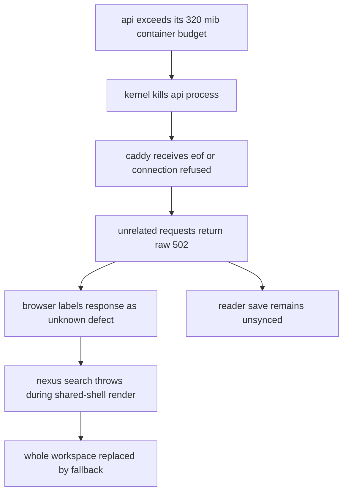
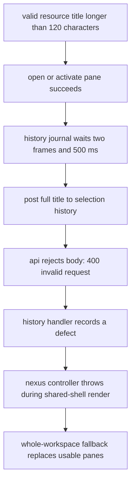

# second-tab crash: council review and proposed repair

> 2026-09-14 pause: historical document; implementation is stopped.
> the [evidence audit](bounded-workspace-evidence-audit.md) distinguishes findings,
> decisions and unverified claims. the [replacement plan](production-crash-replacement-plan.md)
> supersedes this execution scope and awaits user review.

date: 2026-09-13
status: api memory-kill and gateway-classification chain confirmed; no implementation or deployment
production: `7e8fd48244b3b436965037738e05785bb4931be1`
reviewed checkout: `7fa89b88c8342bca9edfb46a6d20053c49555fb2`

the user's follow-up establishes that the workspace also fails during
navigation without opening another pane. unrelated contributor, search,
activity, and reader-state requests all return 502; the workspace then
renders its error boundary. titles do not explain the reported incident.

the corrected production investigation confirms six container-memory kills
of the api. the last kill, 04:06:36 utc, immediately precedes the exact
augustine contributor requests and other failed paths in the user's trace.
caddy reports connection refused. a raw gateway 502 becomes `E_UNKNOWN` in
the browser, is misclassified as a same-system defect, and is thrown by
shell-mounted nexus search. the frontend turns a backend outage into loss
of the entire rendered workspace.

the remaining uncertainty is which allocations and request overlaps exhaust
the 320 mib api budget, and what measured budget/admission policy supports
the intended workload. memory exhaustion is established; a particular memory
leak or expensive endpoint has not been established. the earlier title
finding remains a separate defect, not this incident's diagnosis.

the earlier kernel search escaped regex alternation incorrectly and missed
the oom records. its negative result was invalid. the corrected journal query
and exact container identity are retained in the api ticket.

the allocation follow-up at 04:22 utc finds the running api process at 303 mib
resident, of which 276 mib is private anonymous memory, under a 320 mib cgroup
limit. this is not a measured cold baseline. modest bursts may suffice; no
allocation timeline yet establishes the size or dominant owner of each spike.
the trace's media has 977 fragments containing 6.34 mib of html plus text before
object/response overhead; the deployed reader endpoint materializes them all.
startup also eagerly imports three provider sdk graphs through the runtime
package facade. those are concrete costs and coupling hazards, not a measured
apportionment of the heap. account for the separate python health-check process
inside the same limit. preserve this distinction when explaining “one user”:
user count bounds neither imported program state nor bytes processed per action.

the council comprised three parallel investigations—client lifecycle, server
protocol, and external practice—plus the coordinating production/code review.
the specialist positions below are analytical perspectives, not statements
from outside experts who were consulted.

**what the evidence establishes**

| observation | implication | limit |
|---|---|---|
| both public `/version` endpoints return the production sha above | frontend and api advertise the same deployed source | local fixes cannot be assumed deployed; loaded browser assets were not inspected |
| the user's text matches `AuthenticatedWorkspaceErrorBoundary.tsx:43–47` | an error reached the shared workspace boundary | the log says bootstrap even when the caught failure happens after navigation |
| the history schema limits labels to 120 characters; the client sends complete titles | a valid 121-character resource title can produce a delayed history rejection and whole-workspace fallback | source-proven path, not an observed reproduction of this user's event |
| retained history posts were successful; no selection validation failures appeared in the queried logs | available logs do not corroborate the title trigger for the recent incident | retained logs are not complete historical proof |
| vercel returned eight error records in the queried 24-hour window: non-json 502, `E_INVALID_RESPONSE` | real backend unavailability reached required bootstrap reads | those records concern root/media requests, not a proven in-app tab transition |
| kernel records six `CONSTRAINT_MEMCG` kills of the exact api container at 03:09:11, 03:19:15, 03:20:29, 03:27:13, 04:04:54, 04:06:36 utc | the api exhausts its 320 mib container budget and is killed | current `oom=false` and reset cgroup counters do not describe past kills; the allocating request remains unidentified |
| caddy records the user's augustine routes failing at 04:06:38–39, and openables/activity/cursors during the same outage | the user's trace correlates with the api kill and refused connections | multiple overlapping requests do not identify which allocation exhausted memory |
| `/readyz` returned ready; workers reported healthy | infrastructure was serving at inspection | does not certify earlier requests or client health |
| a content search timed out at 03:23:03 utc | a separate foreground performance failure exists | no demonstrated causal connection to the tab exception |

vercel deployment: `dpl_EzbAXd1AigvoskfzRHeFza64nENU`. error digests:
`2738950100`, `104974553`. exact receipts and paths are retained in the
[api incident ticket](../tickets/second-tab-production-api-restarts.md) and
[search ticket](../tickets/second-tab-production-search-timeout.md).

the current workspace boundary only logs to the browser console. unlike the
newer pane boundary, it does not send a structural defect receipt. the user's
console trace supplied that missing clue; kernel/caddy evidence and the
matching client error path now explain this incident. reproduce the memory
envelope and raw-gateway response against the exact source in an isolated
local runtime, including health-check process overhead.

**the supported incident chain**



repair two independent owners: the api resource envelope and the http error
classification/containment contract. the
[gateway ticket](../tickets/second-tab-gateway-outage-classified-as-workspace-defect.md)
records the unchanged deployed/current source chain and required boundary
proof. a gateway may fail before bff code runs, so browser classification must
also recognize raw availability failures. preserve structured owned defects
and strict successful-response decoding; do not relabel every error retryable.

**the separate history crash path**



the relevant owners are `python/nexus/schemas/nexus_history.py:15–17`,
`apps/web/src/components/nexus/useNexusController.ts:1138–1156`,
`apps/web/src/lib/nexus/useNexusSelectionJournal.ts:8,74–78`, and the
controller's history error adapter at `:350–352`. the deployed api's custom
validation handler returns **400**, not the framework's usual 422.
queries have a related mismatch: raw ingress accepts at most 500 characters,
but the producer does not apply that contract and later server storage
normalizes to 200.

the conceptual error is twofold: history snapshots have a narrower contract
than legitimate navigation, and a secondary history failure has authority
over the entire workspace. fixing either alone leaves the other defect.

**the proposed repair, issue by issue**

| issue and evidence | decision | explicit cost or trade-off |
|---|---|---|
| [gateway outage becomes a workspace defect](../tickets/second-tab-gateway-outage-classified-as-workspace-defect.md); deployed/head and user trace | classify raw gateway 502/503/504 as availability failures at the http boundary; preserve structured owned errors and malformed-success defects. contain nexus recovery locally | bounded reads may retry; mutating operations must retain their existing replay/conflict contract. failed data remains unavailable instead of being fabricated |
| [valid labels rejected](../tickets/second-tab-selection-history-rejects-valid-labels.md); deployed and head | define history labels as bounded display excerpts; normalize once at the history-command boundary, with matching server validation and unicode length semantics. preserve full canonical titles and target identities. define query normalization in the same contract | history excerpts omit some display text; they must never become resource identity. server-derived titles are an alternative only if authoritative metadata is required; they add another resolution/authorization read |
| [history removes workspace](../tickets/second-tab-selection-history-can-fail-workspace.md); deployed and head | isolate history failure under a capability boundary. retain the accepted command and replay identity outside any subtree reset. report defects strictly; preserve reading/editing and provide explicit recovery | that capability can remain failed while reading continues. retaining an uncertain command requires clear ownership; a blind remount can lose it or duplicate it |
| [resource resolver escapes panes](../tickets/second-tab-resource-resolution-escapes-pane-boundary.md); head only | represent a defect against its locator/request generation and surface it beneath each affected pane boundary. unrelated settled panes remain usable; preserve batch decoding and stale-response fences | a malformed batch may invalidate all members of that batch. do not guess which rows are trustworthy or claim every error is pane-specific |
| [workspace save advances before acknowledgment](../tickets/second-tab-workspace-save-acknowledgment.md); deployed and head | distinguish latest desired state, in-flight write, and acknowledged state. serialize/coalesce captures; retain dirty state after failure. fence lifecycle overlap at the server when a keepalive and ordinary write can race | small persistence-state machinery is necessary. coalescing deliberately omits intermediate layout snapshots; it must not omit accepted document edits or history commands |
| [missing shared-workspace telemetry](../tickets/second-tab-workspace-defect-telemetry.md); deployed and head | report workspace/bootstrap/pane scope, release, safe error identity, component location, and request correlation once. keep content and credentials out | structural reporting is less rich than full session replay; it is sufficient for this failure and has a smaller privacy/storage cost |
| [unproven durability assurance](../tickets/second-tab-workspace-recovery-durability-copy.md); deployed and head | remove unconditional “your data is safe”; describe only acknowledged or independently recoverable work. keep recoverable drafts outside the renderer being reset | copy must acknowledge uncertainty until persistence can establish a stronger claim; a document-draft redesign is not authorized merely by the layout-save defect |
| [api memory kills and gateway errors](../tickets/second-tab-production-api-restarts.md); confirmed production | measure baseline, overlapping reads, health-check processes, and retained allocations; right-size the complete cgroup envelope and bound demonstrated expensive work | more memory costs money; lower admission concurrency costs latency. 320 mib has demonstrably failed, but the replacement budget is not yet measured. reserve host capacity rather than raising every service limit |
| [reader cursor 502s](../tickets/second-tab-reader-cursor-save-502.md); user trace and correlated caddy failures | repair the upstream outage; preserve existing unsynced/retry behavior and server revision/identical-position reconciliation | reader position remains unacknowledged until recovery; this caught save failure is not the direct shell exception |
| [cursor loses ownership on teardown](../tickets/second-tab-reader-cursor-teardown-durability.md); deployed/head | retain the latest account/media/generation-bound intent outside the retiring renderer; reconcile through the existing server concurrency contract | durable local pending state needs explicit ownership, account isolation, and conflict behavior; teardown keepalive alone cannot guarantee it |
| [whole-document responses](../tickets/second-tab-reader-content-response-budget.md); deployed and head | after measurement, deliver revision-pinned content windows and only the needed representation; retain complete structure, find, selection, and locator semantics | extra round trips and per-format restoration work. apply only where supported document size makes this necessary; never silently truncate a book |
| [document map drains all evidence](../tickets/second-tab-document-map-response-budget.md); deployed and head | preserve compact complete geography/counts, page detailed evidence with explicit continuation and revision semantics | overview aggregates and detailed rows become separate reads; concurrency must not duplicate or omit annotations |
| [five recents load lifetime history](../tickets/second-tab-nexus-history-read-budget.md); deployed and head | select latest-per-target and top-five in sql, preserving tie-breaking and independent frecency. choose indexes from the measured plan | bounded application materialization does not automatically mean bounded database work; prove the plan as history grows |
| [search statement timeout](../tickets/second-tab-production-search-timeout.md); observed production | compare deployed/current retrievers before new changes; qualify candidate selection, late snippets, and ranking on representative local data | an index consumes storage/write work; reducing candidate counts can reduce recall. neither trade is justified without the measured plan and ranking oracle |

the api memory envelope already sets `mem_limit` and `memswap_limit` to
320m. the cap alone is not a resource policy: it kills excess allocation
after work is admitted. admission, bounded request data, and sufficient
headroom must make the supported workload fit before that point.
[docker's memory controls](https://docs.docker.com/engine/containers/resource_constraints/)
describe the underlying mechanism.

**what the council would ask, agree on, and dispute**

| perspective | first question | position and disagreement |
|---|---|---|
| browser/react | which shared render, effect, or completion throws after activation? | repair its dataflow and ownership. reject speculative memoization or timer changes; a performance hint is not a correctness invariant |
| contracts/distributed systems | is this a resource title, history excerpt, pane identity, visit identity, or persistence writer? | keep those concepts separate. reject browser leadership when the failure is inside one workspace; locking an unrelated resource cannot repair an invalid command |
| reliability | what is the smallest unit we can stop while preserving trustworthy work? | stop and report the failed capability. challenge a literal “every defect crashes everything” interpretation of fail-fast |
| performance | what bytes and allocations increase when this exact second pane opens? | measure per-request and process peaks. challenge both “320 mib must be too small” and “the fallback proves memory is irrelevant” |
| product/ux | what can still be used and what can truthfully be recovered? | keep healthy panes available and recovery local. reject reloading all views or asking the user to avoid multiple tabs |
| verification | what sequence falsifies the claimed invariant before the repair? | use real api validation and browser lifecycle behavior. reject an unconditional-success mock as evidence that the contract composes |

they agree that valid navigation must produce valid bookkeeping, that failure
severity and failure scope are distinct, that acknowledgment must mean
acknowledged, and that user work must not depend on one render tree surviving.

they disagree legitimately about title snapshots versus canonical metadata,
retaining hidden renderers versus restoring them, and whether separate browser
windows share one resume layout. the current browser-profile restore is
explicitly last-write-wins; it is not this in-app-tab bug. retain that product
policy for this repair and state its cost: another browser window can replace
the profile's restore layout. change it only with an explicit window/session
identity contract. a crdt cannot infer which navigation intent should win.

the philosophy is fault containment with truthful state. “strict” means a
violated invariant remains a defect with evidence. it does not require
destroying unrelated usable state. the highest useful layer is the contract
between capabilities: navigation commits; its history observer cannot revoke
it; a view renders a visit; its lifetime does not define data durability.
[react's error-boundary guidance](https://react.dev/reference/react/Component#catching-rendering-errors-with-an-error-boundary)
places boundaries around meaningful recovery units.

**what to steal, and why**

| product or research | supported practice | adaptation for nexus |
|---|---|---|
| [obsidian tabs](https://obsidian.md/help/tabs) and [workspace](https://obsidian.md/help/workspace) | desktop splits/tab groups and mobile tab navigation | preserve shared navigation concepts while choosing different mounting/presentation policies for each device |
| [vs code hot exit](https://code.visualstudio.com/docs/editing/codebasics#hot-exit) | backs up unsaved work for restoration after exit | separate draft ownership from renderer survival; this is a durability property, not just a restore button |
| [readwise reader](https://docs.readwise.io/reader/docs/faqs) | offline reading and later synchronization | make availability and pending work legible; load content according to actual reading needs |
| [firestore persistence](https://firebase.google.com/docs/firestore/manage-data/enable-offline) | explicit single-tab/multi-tab persistence; last-write-wins document writes | make concurrent ownership a documented policy. do not mistake a conflict policy for absence of conflicts |
| [local-first research](https://www.inkandswitch.com/essay/local-first/) | responsiveness, offline use, longevity, and user ownership | adopt durable local drafts and replaceable renderers where required; a whole sync-engine migration does not repair this exception |
| [opentelemetry error guidance](https://opentelemetry.io/docs/specs/semconv/general/recording-errors/) | contextual error classification and recording propagated exceptions once | correlate one safe failure receipt across boundaries; do not equate high aggregate availability with this one user's successful workflow |

first-hand [supabase multi-tab hang reports](https://github.com/orgs/supabase/discussions/35069)
look superficially similar. they concern browser contexts, and current upstream
[lockless coordination](https://github.com/supabase/supabase-js/blob/master/packages/core/auth-js/migrations/lockless-coordination.md)
also changes the old diagnosis. the installed auth source follows that newer
default. this is a useful rejected analogy, not grounds for removing locks,
changing authentication, or claiming production runs the installed version.

**frontier and unconventional options**

there is no single state of the art spanning ux, failure isolation, memory,
and offline consistency. the useful frontier here is making rare failures
reproducible and renderers replaceable without losing meaning.

| idea | judgment | cost or rejection reason |
|---|---|---|
| generated action sequences with an independent model | adopt after the concrete regression | explore open/switch/close/restore/resize and reordered responses; model maintenance must buy new coverage, not mirror implementation |
| deterministic fault replay | adopt narrowly | keep the minimal failing sequence and schedule. borrow the method from [foundationdb](https://www.foundationdb.org/files/fdb-paper.pdf), not a database-scale simulator |
| serializable pane return state | strong architectural direction; extend existing visit/memento ownership | preserve semantic location and draft references; restoration must be implemented per content type |
| bounded warm views with [react activity](https://react.dev/reference/react/Activity) | later experiment after measuring mount latency and residency | activity preserves hidden dom/state and cleans effects, but retains memory and changes the current mobile mounting contract |
| one shared worker owning browser connections | reject for this repair | adds a worker lifecycle and bridge; no evidence of a shared-connection cause |
| elect a browser leader using [web locks](https://www.w3.org/TR/web-locks/) | only for a demonstrated exclusive shared resource | no cross-device coordination; suspension and owner recovery add obligations; irrelevant to two internal panes |
| crdt notes | evaluate only for concurrent offline editing | adds merge, persistence, and migration semantics; unsuitable as a substitute for choosing layout ownership |
| one iframe/webview per pane | reserve for independently justified untrusted-content isolation | more memory, focus/accessibility work, and bridges; same-origin iframes do not guarantee separate processes |
| automatic close/reload, delayed opens, raised retries | reject | they conceal the violated contract, discard context, or repeat deterministic failure |

[react effect troubleshooting](https://react.dev/reference/react/useEffect#my-effect-keeps-re-running-in-an-infinite-cycle)
and its [memoization contract](https://react.dev/reference/react/useMemo)
support removing unnecessary synchronization rather than making correctness
depend on cached callback identities. no such loop was established in this
incident. [model-based testing](https://fast-check.dev/docs/advanced/model-based-testing/)
provides a practical way to explore lifecycle sequences after a small oracle
has been specified.

mobile adds a hard constraint: unload is not a reliable saving opportunity.
[chrome's lifecycle guidance](https://developer.chrome.com/docs/web-platform/page-lifecycle-api)
explains hidden/frozen/discarded states;
[android's webview guidance](https://developer.android.com/develop/ui/views/layout/webapps/managing-webview)
requires replacing a terminated renderer. these establish recovery duties,
not evidence that this user experienced renderer termination.

**execution order and acceptance**

1. retain the confirmed kernel/caddy/client chain and production sha. measure
   the exact api artifact under representative concurrent navigation, including
   health checks. fix capacity and any demonstrated unbounded allocation;
   verify no memory kills, restarts, or host contention under the supported load.
2. repair gateway error classification and capability containment. inject raw
   502/503/504 responses both through and ahead of the bff. healthy panes and
   drafts survive; scoped reads recover; owned defects stay strict; writes
   are not blindly replayed. add the missing structural error receipt.
3. repair the separate history command contract and capability containment.
   demonstrate rejection before the repair, then successful navigation,
   preserved sibling work, one history record, and strict malformed-request
   rejection afterward. cover desktop and mobile, unicode and query bounds.
4. repair save acknowledgment and lifecycle ordering, including retained reader
   cursor intent. a failed save remains
   dirty; an older completion cannot clear or overwrite newer intent. retry
   and restore must follow the chosen browser-profile policy.
5. repair head's resolver containment and recovery reporting/copy. inject a
   malformed response with one healthy sibling; only the affected capability
   fails. stale visits and cleanup cannot publish into replacements.
6. qualify the remaining search/history workload. replace demonstrated
   unbounded materialization at its owner; use supported corpus sizes and
   independent completeness/locator/ranking oracles. do not turn every
   speculative performance idea into a prerequisite for the crash fix.
7. use the existing `./scripts/test` controller and `deployment.md` release
   protocol. the substantial production/head gap includes other changes and
   migrations; “deploy head and see” is not an incident repair plan.

verification already run:

```text
./scripts/test changed --base HEAD \
  apps/web/src/components/nexus/Nexus.browser.test.tsx \
  apps/web/src/lib/panes/usePaneResourceResolutionRegistry.browser.test.tsx \
  apps/web/src/lib/workspace/useWorkspaceSession.browser.test.tsx
```

receipt: `test-results/runs/10c80d0cc61aef53/summary.json`; status `pass`,
30.6 seconds. selected static-web and real chromium component commands passed.
this checks the current checkout, not deployed behavior. existing history
fixtures default to successful writes; the regression above was not added
or executed. no sensitivity claim, production reproduction, full-suite pass,
or memory fix is implied. all repository changes from this investigation
are this review, issue tickets, and register entries.
