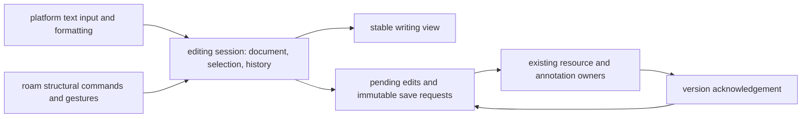

# notes and annotations: writing council

status: historical research; implementation decisions now live in the two specs
date: 2026-09-25
repository baseline: cfa27d6ce615bb4775e7784954f19dcdd8c8ebb1
method: three native research agents, primary-source web research, static code
review, and an architectural synthesis. the disciplines below are review
perspectives, not quotations from outside experts. no product code changed.

approved follow-up: [writing/saving](notes-writing-plan.md) and
[bullet interaction](notes-bullets-plan.md) supersede the proposals below.
the user requires shared bidirectional, nonhierarchical links and link-mutating
indent/outdent. canonical-parent and occurrence-owned alternatives below are
rejected; they are retained only as the research history.

## the actual brief

make writing in nexus notes, annotations, link notes, and quick capture feel as
immediate, quiet, and trustworthy as apple notes on iphone and mac. use roam's
bullet appearance and structural interaction where an outline is being edited.
the user's latest clarification explicitly excludes product navigation,
offline support, and the full apple or roam feature catalogue. earlier broader
answers about navigation/offline are superseded.

reliable pending-edit recovery is part of saving. it does not authorize offline
application loading, a local notes database, background synchronization across
devices, search redesign, or a new native app. changing indentation must not
turn into a graph-product rewrite by stealth.

research dossiers:

- [apple writing reference](research/notes-apple-reference.md)
- [roam bullet reference](research/notes-roam-reference.md)
- [current implementation and defects](research/notes-current-system.md)

## judgment

the direction is good. the initial responsibility split is wrong. touch,
keyboard, bullets, text selection, and undo all act on the same editable state.
splitting that state between two implementations produces exactly the friction
the user wants removed.

keep two prs, stacked in dependency order. the apple-inspired foundation owns
the editing session, selection, history, composition, clipboard, save lifecycle,
and shared visual treatment. the roam layer supplies structural commands and
their bullet, keyboard, and pointer bindings through that session. it cannot
own a separate undo stack or save path.

the shortcut catalogue belongs to the roam workstream, but ordinary platform
text editing must already work in the first pr. physical input is an adapter,
not an ownership boundary: clicking a bullet and pressing a zoom shortcut invoke
the same command; toolbar bold and keyboard bold invoke the same format command.

retain apple-like rendered rich text while editing. reproducing roam's raw
markup presentation is not implied by borrowing its bullets. this is an
intentional hybrid, with structural keys subordinate to the active editing
context and platform-reserved behavior. title derivation is also a separate
choice; do not add a compulsory title field to compact annotations.

## what the disciplines agree on, and dispute

| perspective | requirement | objection to the naive plan | consequence |
| --- | --- | --- | --- |
| product and interaction | thought reaches the page without a preparatory mode | copying screenshots preserves neither speed nor predictability | specify focus, caret, selection, interruption and save outcomes before pixels |
| typography and visual design | text is the dominant object; structure remains legible | tiny controls and hidden affordances can look minimal while being difficult | quiet chrome, stable text measure, generous invisible hit areas, visible keyboard focus |
| editor engineering | one coherent text/structure/selection/history transition | a key handler and a click handler cannot independently edit the same structure | one command owner, native input/composition where possible, deliberate history grouping |
| persistence | acknowledged edits survive normal leave/reopen; failure tells the truth | a debounce timer and a recovery banner do not establish durability | immutable submitted requests, recoverable later edits, explicit local and remote outcomes |
| graph and data | note identity and contextual placement remain intelligible | nexus context edges are not roam's canonical parent tree | decide containment separately from reference before adding nesting |
| accessibility | standard text editing remains usable by touch, keyboard and assistive technology | blanket interception of tab/arrows or drag-only reordering breaks platform behavior | scope structural keys; provide an escape from indentation and a non-drag move action |
| performance | character feedback and caret motion do not wait on the network | shortening autosave timers does not fix synchronous serialization or remounts | measure actual devices; remove work from the input path through its owner |

the substantive disagreements are these:

- the visual designer prefers less visible machinery; accessibility requires
  discoverable actions and usable targets. hide decoration, not capability.
- roam fidelity favors a canonical block tree; nexus currently permits shared
  note resources in multiple contexts. neither silently rewriting those
  relationships nor pretending a graph is a tree is acceptable.
- one continuous editor simplifies native range selection and undo; existing
  independent note editors naturally match current resource identity. prefer
  one editing session and evaluate a continuous prosemirror view, but do not
  declare a full-document rewrite correct merely because its api is elegant.
- autosave should be unobtrusive; actual persistence failure must interrupt that
  quiet. an exceptional truthful warning is preferable to invisible loss.

## philosophy worth copying

apple's useful lesson is continuity: text stays text while the user taps,
selects, formats, corrects, and leaves. its mac guide documents automatic saving
and distinct paste behaviors. that supports a low-ceremony writing contract;
it does not disclose apple's implementation or exact crash guarantees.
[apple mac 26 writing guide](https://support.apple.com/guide/notes/create-and-edit-notes-not9474646a9/4.13/mac/26)

roam's useful lesson is that structure is editable at the speed of composition.
blocks have identity and ordered containment, with references distinct from
containment. indentation is therefore a document operation, not extra spaces.
the official syntax and query references expose this model; they do not prove
the internal rendering or synchronization implementation.
[roam syntax](https://raw.githubusercontent.com/Roam-Research/roam-tools/master/skills/roam-syntax/references/syntax.md),
[roam queries](https://raw.githubusercontent.com/Roam-Research/roam-tools/master/skills/roam-syntax/references/queries.md)

the synthesis is quiet presentation with strong semantics: no need to learn the
storage model to write, no need to distrust the result after rearranging it.
borrow bear's emphasis on legible text, workflowy's direct outline manipulation,
and dynalist's explicit keyboard vocabulary where the dossiers support them.
these are references for specific interactions, not a claim that one product is
universally best or a reason to import their entire feature sets.

## current facts that change the plan

the [current architecture](architecture.md#87-notes-and-pages) explicitly
defines a flat resource surface. pages own titles; notes own a single
prosemirror body block; ordered context edges own occurrences. each displayed
note has an independent editor and history. hierarchy, collapse, and cross-note
merge are deliberately absent. this is the present contract, not a bug.

there are real saving concerns, independently of any redesign:

- [local save feedback can overstate durability](tickets/notes-local-save-feedback-can-overstate-durability.md)
- [changed content can reuse an ambiguous mutation id](tickets/notes-retry-can-reuse-mutation-id-with-changed-content.md)
- [suggested reload recovery discards pending edits](tickets/notes-recovery-reload-discards-pending-edits.md)
- [draft decoding deletes the recovery payload](tickets/notes-draft-decoding-deletes-unrecoverable-payload.md)
- [new annotation drafts can become undiscoverable](tickets/annotation-draft-key-changes-before-first-save.md)
- [link-note saving drops replay identity](tickets/link-note-adapter-drops-editor-mutation-identity.md)
- [link-note editing lacks existing-body hydration](tickets/link-note-editor-does-not-hydrate-existing-body.md)

these are static findings, not observed production data loss. ordinary typing
also synchronously serializes the acknowledged surface and pending work. its
cost grows with content, but the user's sluggishness has not been causally
attributed by a trace. [measurement ticket](tickets/notes-keystroke-cost-needs-device-measurement.md)

the quick annotation composer currently gives enter a submit-and-close meaning;
surface notes split on enter; standalone bodies insert a hard break. the shared
spec must make these differences intentional. recommended policy: enter keeps
writing, with structural meaning inside outlines; a separate done action may
dismiss. saving never depends on that action. this is a deliberate change to
existing quick-annotation behavior.

## ownership and implementation direction

retain prosemirror. the repository already depends on it; changing engine or
adding a second editor framework has no established benefit. its transaction
model can represent document and selection changes and compose history. the
framework leaves product commands to the application.
[prosemirror guide](https://prosemirror.net/docs/guide/)

one logical editing session owns the current document, selection and history
for each writing surface. the persistence owner consumes accepted changes;
server replies acknowledge versions rather than replace newer editor state.
domain adapters attach content to a page, highlight, or link. those attachment
rules stay with their existing owners. share mechanisms only where these
current consumers need them; do not build a generic editor platform.

proposed flow:

keyboard events are insufficient for dictation, autocorrect, context-menu
formatting and composition. preserve the platform input pipeline; respect
non-cancelable composition events and wait to transform composed text until
the composition boundary permits it. the w3c input-events text is a working
draft, not evidence every target browser implements it identically.
[webkit input events](https://webkit.org/blog/7358/enhanced-editing-with-input-events/),
[input events level 2](https://www.w3.org/TR/input-events-2/)

preserve the existing mobile gesture-time textarea handoff where it is needed
to summon the keyboard and hold an unfinished composition. it is a temporary
input adapter, not permission for a second durable editor state. verify its
handoff rather than deleting it to satisfy an abstract one-element rule.

saving must distinguish an in-memory edit, a successfully retained local draft,
and a server acknowledgement. a request's id and payload become immutable once
submitted. subsequent edits remain separate until that outcome is resolved.
retire only the acknowledged revision; never clear a newer draft on an older
reply. retain the existing server's exact replay and version checks.

commit pending edits during normal editing; leaving the page is only an extra
flush opportunity. browsers can discard a page without running final callbacks.
this is a reason to repair saving, not to build offline mode.
[browser lifecycle](https://developer.chrome.com/docs/web-platform/page-lifecycle-api)

do not select indexeddb, a crdt, a worker, virtualization, or a new state-machine
framework by reflex. first bound and measure the current pending journal. if
it cannot meet the accepted durability and input-time budgets, replace its
storage owner with one asynchronous transactional implementation. that choice
adds commit ordering and storage-failure handling; it does not make browser
storage immune to eviction. [webkit storage policy](https://webkit.org/blog/14403/updates-to-storage-policy/)

## containment is the unresolved architectural decision

example: the same note appears in two pages. indent a child under it in one.
does the other appearance acquire that child? this choice determines whether
the outline belongs to the note or to its occurrence. css cannot answer it.

| choice | benefit | cost / objection |
| --- | --- | --- |
| canonical block parent; extra appearances are references/embeds | closest to roam's distinction between ownership and reference | existing shared placements need an explicit mapping and may change meaning; not a cosmetic migration |
| occurrence-local parent and sibling order | preserves contextual reuse and bounds the writing change | the same note can have different children in different contexts; explicit deviation from roam subtree identity |
| recursively treat all context edges as children | superficially reuses existing data | rejected: shared descendants and longer cycles are not an outline; generic contextual links acquire unintended ownership |
| store another durable whole-tree document beside graph rows | convenient editor serialization | rejected: two authoritative structures drift |

recommend canonical containment if exact roam block semantics remains the
requirement. before committing to it, inventory existing repeated placements,
nested edges and cycles and write the conversion examples. under the narrowed
writing-only scope, occurrence-local containment is a defensible alternative
only with its divergence explicitly accepted. no migration or database census
was run here; no existing graph data was changed.

flat presentation does not mean flat stored data: the vault importer authors
nested note edges and artifact readers traverse descendants. a canonical home
cannot be inferred from an arbitrary first placement. occurrence-local nesting
also needs an explicit surface/root-scoped placement contract, rather than a
parent field bolted onto resource-owned adjacency.
[containment census ticket](tickets/notes-outline-containment-needs-existing-data-census.md)

a continuous prosemirror document may be an in-memory projection of canonical
resource/occurrence data. it must not become a competing persisted truth.
choose the representation after the containment contract; preserve stable ids,
attachments, reference targets, and existing content through any cutover.

even canonical containment allows multiple visible reference/embed occurrences.
selection and focus identify the visible occurrence and text position; a body
mutation identifies the canonical content. a note id alone cannot locate the
caret when that note is displayed twice.

## the two prs

| pr | owns | acceptance boundary |
| --- | --- | --- |
| 1: apple-quality writing and saving | shared prose/session contract; caret, selection, composition, normal platform text keys, inline formatting and clipboard; quiet writing styles; persistence/recovery repairs across notes, highlights and link notes | writing and leave/reopen work on iphone and mac; failures preserve work and report truth; existing structural behavior still works |
| 2: roam-quality outline interaction | the agreed containment change, structural commands, bullet/disclosure visuals, indentation, reorder, fold, outline-local zoom, block selection, structural clipboard and history integration; verified shortcut mapping | tree/text/selection transitions are atomic and undoable; equivalent toolbar, pointer and key actions agree; identities and references survive |

both specs are written before either implementation so pr 1 does not cement
the wrong history or document boundary. pr 2 stacks on pr 1, rebases after it
merges, and runs the combined acceptance cases. do not develop two conflicting
editor cores and ask git to integrate the semantics afterward.

potential implementation work packages: one owner for the editor/session and
key dispatch; one for persistence plus domain adapters; one for presentation
and physical-device review. assign disjoint file ownership after the specs,
and pass explicit interfaces between them. the second pr's structural owner
extends that same session. no arbitrary agent quota or competing rewrite.

likely owners are mapped in the code dossier. replace/delete superseded save
paths, key handlers, per-block history ownership and styles where the selected
design makes them obsolete. retain only paths that still serve distinct real
surfaces. do not add compatibility flags or weaken replay checks. schema
changes require a concrete data-preserving migration and rollback/repair plan;
a git revert alone does not reverse newly stored user content.

## acceptance to turn into the two specs

all rows are proposed criteria, not reported passes.

| id | concrete check | required result |
| --- | --- | --- |
| w1 | open each existing writing surface, tap or click a word, type immediately | correct caret, no second activation step, no input lost during hydration |
| w2 | iphone select/drag handles, autocorrect, dictation, emoji and a composing keyboard; mac word/line selection and deletion | native text behavior; no premature split, duplicate text or selection jump |
| w3 | apply supported formatting using touch toolbar, context menu and hardware keys | equivalent result and stable selection; undo restores content and formatting |
| w4 | paste multiline prose, formatted text, outline text, urls and existing nexus references | specified normalization, preserved supported meaning, no accidental import or silent structural flattening |
| w5 | type then dismiss, switch context, background, and reopen each composer | latest successfully retained revision recovers; normal navigation is unchanged |
| w6 | commit server write, lose reply, type more, retry; deliver old reply after newer typing | exact replay once, successor retained, no stale replacement |
| w7 | fail storage and network; trigger version conflict; try recovery; encounter undecodable draft | truthful status, export/recovery access, no implicit discard |
| w8 | save an annotation and a link note; dismiss and reopen | same content and identity; quote/attachment preserved |
| r1 | enter at start/middle/end; shift-enter; empty root/nested block; backspace/delete at boundaries | observed/reference-approved split/join/outdent behavior with explicit subtree ownership |
| r2 | indent/outdent or move a subtree; fold/expand; zoom in/out | no cycles, lost descendants, accidental clones or unstable focus; zoom stays within editing scope |
| r3 | select text across blocks; select several blocks; paste/cut; undo/redo mixed text and structure | one coherent history and restored selection; clear text versus block selection |
| r4 | reorder by pointer and without dragging; operate with screen reader and keyboard | action available without precision dragging; structural keys do not trap focus |
| v1 | compare the pinned mac/iphone references at matching scale, light/dark, keyboard open, enlarged text | approved text geometry, quiet chrome and bullet states; no imitation measured by memory |
| p1 | record traces for a short annotation, representative note, and large/deep outline | no network-gated character paint; bounded input work; no save-induced caret/scroll movement |

provisional performance targets for discussion: p95 key-to-next-paint below
50 ms on the named target devices and no sustained editing long tasks above
50 ms in the agreed samples. these are nexus targets, not measured apple
numbers or universal perceptual thresholds. ordinary web inp's 200 ms good
threshold is not sufficient by itself to call an editor smooth.
[inp definition and thresholds](https://web.dev/articles/inp)

ng and colleagues' 2012 direct-touch study found perceptible dragging latency
below the then-common 100 ms assumption. the transferable point is to measure
feedback during direct manipulation; its experimental hardware does not set
today's iphone typing budget.
[direct-touch latency paper](https://www.tactuallabs.com/papers/designingLowLatencyDirectTouchInputUIST12.pdf)

use a small set of representative documents and record actual device/browser,
keyboard, sample count and trace method; separately assess typing, tap-to-caret
and structural commands. long-note limits and exact visual measurements remain
to be agreed, not invented as pseudo-precision.

iphone and mac define the requested references. shared-editor changes also
need a focused regression check in the already-shipped android webview; that
does not enlarge this into an android redesign.

keep visible bullets small if the reference calls for it, but give controls
adequate hit areas; provide a single-pointer alternative to dragging. wcag's
minimum target criterion has spacing and other exceptions and is not an iphone
pixel-spec substitute.
[target size](https://www.w3.org/WAI/WCAG22/Understanding/target-size-minimum.html),
[dragging alternatives](https://www.w3.org/WAI/WCAG22/Understanding/dragging-movements.html)

## evidence and remaining decisions

the public roam help material disagrees about a mac zoom modifier. screenshots,
exact hit geometry, ambiguous boundary operations, gesture timing, and actual
save-after-background behavior need version-pinned observation. record unknowns
instead of turning a cheat sheet into an oracle.
[reference evidence ticket](tickets/notes-reference-interactions-need-pinned-observation.md)

the council would settle these before declaring the specs implementation-ready:

1. canonical block ownership versus occurrence-local structure, using the
   two-page example and actual current-data inventory.
2. the intended enter/done behavior in compact annotations, and whether a
   compact annotation exposes outlining or only the shared prose core.
3. the exact everyday formatting and clipboard whitelist; preserve existing
   references and supported content without importing a full feature suite.
4. target iphone/mac browser and os versions, actual roam reference surface,
   and the measured visual/interaction specimen set.
5. the save acknowledgement vocabulary and the failure/leave contract,
   including the distinction between local retention and remote durability.

verification follows [the current local standard](local-rules/testing-standards.md):
`./scripts/test` is static only. manual device and real-stack checks establish
behavior. a small automated regression for ambiguous-save replay or destructive
draft recovery may be justified by silent data-loss risk, but there is no
permission to reconstruct the retired test infrastructure. this research did
not exercise application, database, device, or production behavior.

research-pass verification: `./scripts/test` passed with a temporary writable
`UV_CACHE_DIR` after the sandbox denied the default uv cache. the build emitted
the five already-tracked custom-highlight minifier warnings
([existing ticket](tickets/offline-css-minifier-rejects-highlight-syntax.md)).
this establishes static/build consistency only; all interaction acceptance
rows above remain not run.
